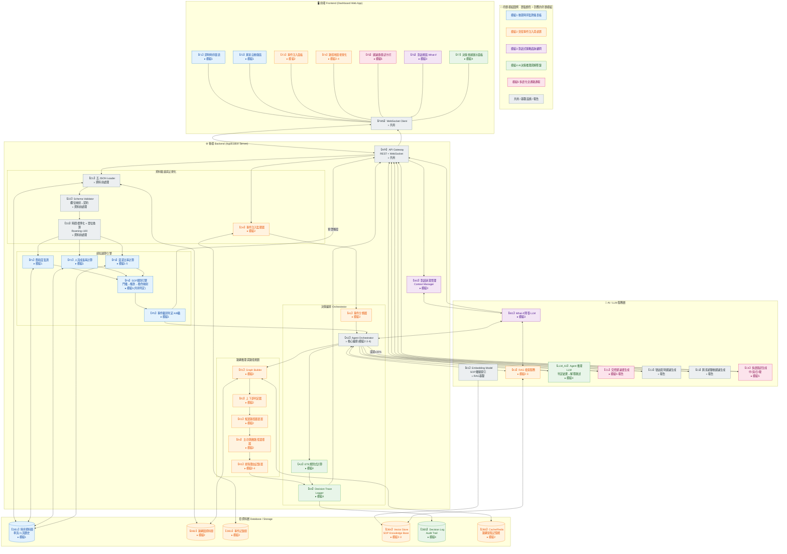

# 智慧交通決策中樞 — 前後端分層架構圖（整合版）

> 對應 `中華電信_智慧交通命題說明.md` 之模組 1~5 需求。
> 本檔是四端架構的**單一權威版本**（早期的敘述版與連線修正版已合併至此，不再另存檔案）：
> 保留四端總覽、模組對照與技術選型，圖採用**已校對過的正確連線**（含命題模組配色圖例）。
> 新版資料實作圖另見 `diagrams/architecture-json-live.svg`；資料契約以 `模組間資料流通規格.md` 為準。
> 在 Kiro / VS Code 中開啟本檔案，右上角可點選「Open Preview」以圖形化檢視 Mermaid 圖。

---

## 一、資料現況提醒（設計前提）

資料集已更新為 `data/` 下五個**名實相符**的 canonical JSON，不再有檔名與內容錯置的問題：

| 檔案 | 內容 | 筆數 | 分類 |
|---|---|---:|---|
| `city_traffic_flow.json` | 車流時序 | 112 | `provided` |
| `signaling_crowd_density.csv` | 基地台人流信令 | 37（9 站，時間點不規則） | `provided`（2026-07-28 主辦方補齊真實資料，取代原模擬版） |
| `road_network_topology.json` | 路網拓樸 | 15 | `provided` |
| `live_incidents.json` | 即時事件 | 3 | `provided` |
| `emergency_traffic_sop.json` | SOP 第 1~7 條 | 7 sections | `provided` |

兩個仍必須保留「資料驗證與正規化」子模組的理由：

1. **人流信令已存在**（含 `User_Count`／`Growth_Rate`／`Roaming_User_Pct`），SOP 第 3、4、6 條可由資料直接觸發；[2026-07-28 更正] 已是主辦方補齊之真實資料，**不再需要**標示 Demo／Simulated。
2. **raw 與交換契約是兩層格式**：原始欄位為大小寫混合（真實CSV為 `BS_ID`／`Location_Name` 等）、時間無時區，且 `Roaming_User_Pct` 是**帶 % 符號的字串**（例如 `"40%"`）須先去除 % 再除以 100，而 `Growth_Rate` 已是小數率不可再轉換。SOP 需由 `section_number` 映射成 `SOP-N`。

詳細欄位映射與驗收基準見 `模組間資料流通規格.md`。

---

## 二、分端總覽（四端架構）

| 端 | 角色 | 技術選型建議 |
|---|---|---|
| **前端 Frontend** | Dashboard UI、圖表、SVG 拓樸圖、對話視窗，只做展示與使用者互動 | 競賽版：HTML/CSS/原生 JS + Chart.js + SVG + Fetch + 原生 WebSocket（正式版可換 React + Socket.io） |
| **後端 Backend** | 資料驗證、感知運算、路網演算法、ETE、決策留痕，並以工具形式提供給 Agent | Python FastAPI + networkx + Pydantic |
| **AI / LLM 服務層** | Agent 工具選擇、RAG 檢索、解釋敘述與多語內容生成 | Amazon Bedrock（Foundation Model + Knowledge Bases）+ Strands Agents |
| **資料層 Database** | 時序、路網、事件、向量庫、決策日誌、快取 | 競賽版：`data/` 五個 JSON + Python 記憶體 + Bedrock KB／S3 Vectors（正式版才用 Timescale／Neptune／Redis） |

**關鍵設計原則（三層決定要分清）**：

1. **選工具＝LLM**：`A2 Agent Orchestrator` 由 LLM 判斷該呼叫哪些工具（規則、路網、ETE、RAG）。
2. **算答案＝決定性工具**：交通 A/B 級、主／次路線、ETE 與恢復時間一律由 Python 規則引擎與演算法算出。
3. **寫文字＝LLM**：建議書、簡訊與解釋敘述只是把上一層的結果轉成自然語言。

LLM 可以決定「叫誰做」，但不得產生或修改事實欄位（事件 ID、位置、級別、路線、ETE、SOP 條款），這樣才能保證「精準引用 SOP 條款」不失真、不幻覺。

---

## 三、各端模組對照表

### 前端 Frontend（對應模組1/2/3/4/5 的呈現）

| 模組 | 說明 |
|---|---|
| F1 即時時序圖表 | 車流/人流時間軸視覺化（模組1） |
| F2 異常自動彈窗 | SOP 門檻觸發時自動跳出摘要（模組1） |
| F3 事件注入面板 | 管理員匯入 `live_incidents.json`（模組2） |
| F4 路徑地圖視覺化 | 主/次疏散路徑、排除路段標示（模組2/4） |
| F5 建議書/簡訊卡片 | 交控建議書、多語簡訊呈現（模組5） |
| F6 對話視窗 | What-if 假設性問答輸入框（模組3） |
| F7 決策依據展示面板 | AI 判定依據、排除理由展示（模組4） |
| WS Client | 訂閱後端 WebSocket，接收即時推播 |

### 後端 Backend（決定性運算 + Agent 編排）

> 註：後端不自行實作模型推理，但 `A2` 是以 Strands Agent 形式跑在 FastAPI 內、由 Bedrock LLM 決定呼叫哪些工具。所有事實計算（A/B 級、路線、ETE）仍由下列決定性子模組負責。

| 子模組 | 說明 |
|---|---|
| API Gateway | REST + WebSocket 對外介面，前端唯一入口 |
| 資料驗證與正規化 (D1-D4) | 五 JSON Loader、Schema 校驗與欄位映射、時間標準化與單位換算（`Roaming_User_Pct ÷ 100`）、事件注入監聽 |
| 感知運算引擎 (P1-P5) | 飽和度、成長率、漫遊比率計算，A/B 級判定（模組1） |
| SOP 規則引擎 | 結構化門檻 → SOP 條款編號 → 預期動作的**決定性映射**（供 P5、A1 呼叫，確保條款引用不失真） |
| 路網推理與路徑規劃 (R1-R5) | 建圖、上下游判定、候選路徑篩選、主/次疏散選擇、排除理由記錄（模組2，需 60 秒內完成） |
| 決策編排 Orchestrator (A1-A4) | 事件分類、**A2 以 LLM 決定呼叫哪些工具**、ETE 規則式計算、Decision Trace Logger（模組4） |
| 對話狀態管理 (W2) | What-if 對話的 Session/Context 管理（模組3） |

### AI / LLM 服務層（由後端呼叫，回傳自然語言結果）

| 子模組 | 說明 |
|---|---|
| Embedding Model | SOP 文本向量化（離線索引用） |
| RAG 檢索服務 | 依語義從向量庫檢索相關 SOP 條款原文 |
| Agent 推理 LLM | 由 Orchestrator 呼叫，把結構化判定結果轉成推理敘述（模組4解釋鏈） |
| What-if 問答 LLM | 處理假設性問題，重跑判定邏輯後生成回答（模組3） |
| 交控建議書生成 LLM | 產出建議書文字（模組5、報告） |
| 號誌配時建議生成 | 產出號誌調整文字說明 |
| 跨系統聯動建議生成 | 產出捷運/公車/警察聯動建議文字 |
| 多語簡訊生成 LLM | 中/英，加分日/韓（模組5） |

### 資料層 Database

| 子模組 | 說明 |
|---|---|
| 時序資料庫 | `city_traffic_flow.json`（112 筆）、`signaling_crowd_density.csv`（36 筆，真實資料；[2026-07-28再更正] 原37筆為wc -l誤把標題列算入） |
| 路網圖資料庫 | `road_network_topology.json`（segment_id、intersections、alternatives、capacity_vph；**無 GIS 座標**） |
| 事件記錄庫 | `live_incidents.json`（3 筆）注入歷史 |
| Vector Store | SOP 條款 Embedding（供 RAG 檢索） |
| Decision Log | 決策軌跡、排除理由留存（供 F7 解釋面板、稽核回放） |
| Cache/Redis | 路網圖常駐記憶體，滿足 60 秒重規劃 SLA |

---

## 四、四端架構圖（已校對連線 · 含命題模組配色）

> 節點顏色對應命題模組（見圖例）。此圖已依情境 A/B/C 逐線校對，修掉原圖漏畫、多畫、接錯的邊（修正明細見第五節）。



---

## 五、連線修正說明（對照最初版本）

上圖相對於**最初的架構圖草稿**（已不保留檔案），依情境 A/B/C 校對後做了以下修正。此節僅作為設計歷程記錄，供簡報說明「我們校對過連線」：

| # | 原圖問題 | 修正 | 依據 |
|---|---|---|---|
| 1 | `D4` 沒有任何輸入邊，事件注入進不來 | **新增 `API --> D4`** | 情境 B：`F3 → API → D4` |
| 2 | `W2` 沒有入口邊，What-if 問題送不進來 | **新增 `API --> W2`** | 情境 C：`F6 → API → W2` |
| 3 | `W2 --> A2` 為多餘錯誤邊（W2 只是狀態管理，不做編排） | **移除 `W2 --> A2`**，重算改由 `W1 <--> A2` | 情境 C：W1 請 A2 重跑判定 |
| 4 | `D3 --> P1` 只餵 P1，漏掉並行的 P2、P3 | **改為 `D3 --> P1 & P2 & P3`** | 情境 A：D1~D3 → P1~P3 |
| 5 | `P3 -->\|Roaming>=30%\| C4`：P3 只有數字，無法生成簡訊內容 | **改為 `A2 -->\|漫遊≥30%\| C4`**，由 A2 統一編排 C1~C4 | 情境 B：A2 交給 C1/C2/C3，並在漫遊達標時呼叫 C4 |

**變更重點摘要（給評審看）：**

- 新增 2 條入口線：`API --> D4`、`API --> W2`，讓事件注入與 What-if 都有明確入口。
- 移除 1 條錯誤線：`W2 --> A2`（W2 定位為狀態管理，重算走 `W1 <--> A2`）。
- 修正 1 條分流線：`D3 --> P1` → `D3 --> P1 & P2 & P3`（感知三模組並行）。
- 修正 1 條觸發線：多語簡訊觸發由 `P3 --> C4` 改為 `A2 --|漫遊≥30%|--> C4`，讓 A2 成為 C1~C4 的單一編排點，且 C4 能取得事故上下文（位置/類型/ETE/改道）。

> 其餘連線（日常監測鏈、事件應變鏈 R1~R5、A2 的 RAG/解釋/決策留痕、結果回傳）皆與文字說明一致，予以保留。

---

## 六、跨端互動情境（含逐線對照驗證）

### 情境 A：日常監測（模組1，純後端＋資料層，無 LLM）

**流程敘述：**
```
DB1(時序資料) → BE.D1~D3(驗證正規化) → BE.P1~P3(飽和度/成長率/漫遊比率)
   → BE.P4(SOP規則引擎比對門檻) → BE.P5(A/B級判定)
   → API → FE.F1(圖表更新) / FE.F2(達門檻時自動彈窗)
```
全程不需要 LLM，屬於純後端+資料層的即時運算迴圈。後端每 5~15 秒推進一次並以 WebSocket 主動推播；前端輪詢僅為斷線時的退路。

**逐線對照：**
```
DB1 ──> D1 ──> D2 ──> D3 ──> (P1 & P2 & P3) ──> P4 ──> P5
                                                          │ 預警觸發
                                                          ▼
                                                    API ──> FWS ──> F1 / F2
```
對應線：`D1<-->DB1`、`API-->D1-->D2-->D3`、`D3-->P1&P2&P3`、`P1&P2&P3-->P4-->P5`、`P5-->|預警觸發|API`。

### 情境 B：突發事件應變（模組2/4/5，60 秒 SLA）

**流程敘述：**
```
FE.F3(管理員注入事件) → API → BE.D4(事件監聽) → DB3(存檔)
   → BE.A1(事件分類，對應SOP 2/3/5條)
   → BE.A2(Orchestrator) 同時：
        (a) 呼叫 AI.K3 做 RAG 檢索 SOP 條款原文（從 DB4 向量庫）
        (b) 呼叫 BE.R1~R5 路網重規劃（讀 DB2/DB6，需在 60 秒內完成）
        (c) 呼叫 BE.A3 計算 ETE
   → BE.A4 記錄完整決策軌跡到 DB5
   → BE.A2 將結構化結果交給 AI.LLM_A2 / C1 / C2 / C3 生成自然語言建議書
   → 若漫遊比率 >= 30%，同時呼叫 AI.C4 生成多語簡訊
   → 全部結果經 API 推播 → FE.F4(路徑地圖) / F5(建議書卡片) / F7(決策依據)
```

**逐線對照：**
```
F3 ──> API ──> D4 ──> DB3(存檔)
                 └──> A1 ──> A2
   A2 同時：
     (a) A2 <──> K3 <──> DB4        RAG 檢索 SOP 條款原文
     (b) A2 ──> R1 ──> R2 ──> R3 ──> R4 ──> R5 ──> A4   路網重規劃(讀 DB2/DB6)
     (c) A2 ──> A3 ──> A4           ETE 計算
   A4 ──> DB5                       決策軌跡留痕
   A2 ──> LLM_A2 / C1 / C2 / C3     生成建議書文字
   A2 ──|漫遊≥30%|──> C4            達標才生成多語簡訊
   C1&C2&C3&C4 / LLM_A2 / A4 ──> API ──> FWS ──> F4 / F5 / F7
```
對應線：`API-->D4`、`D4<-->DB3`、`D4-->A1-->A2`、`A2<-->K3<-->DB4`、`A2-->R1..R5-->A4`、`A2-->A3-->A4`、`A4-->DB5`、`A2-->C1&C2&C3`、`A2-->|漫遊≥30%|C4`、回傳線。

### 情境 C：What-if 問答（模組3）

**流程敘述：**
```
FE.F6(輸入假設問題) → API → BE.W2(帶入對話上下文)
   → AI.W1 呼叫 AI.K3 檢索相關 SOP 條款
   → AI.W1 呼叫 BE.A2 用假設參數重跑一次判定邏輯（不寫入正式 DB5，僅模擬）
   → AI.W1 組合「觸發條款 + 預期動作」回答 → API → FE.F6 顯示回答
```
重點：**W1 不能自己編造 SOP 條款**，必須透過 BE.A2 的規則引擎重新算一次，確保回答有據可查。

**逐線對照：**
```
F6 ──> API ──> W2(帶入對話上下文) <──> W1
                                      │
                                      ├── W1 <──> K3 <──> DB4   檢索 SOP 條款
                                      └── W1 <──> A2            用假設參數重跑判定(僅模擬,不寫 DB5)
   W1 ──> API ──> FWS ──> F6 顯示回答
```
對應線：`API-->W2`、`W2<-->W1`、`W1<-->K3`、`W1<-->A2`、`W1-->API`。
重點：**W2 只做狀態管理，不編排**；SOP 條款靠 K3 檢索、級別判定靠 A2 規則引擎重算，W1 不自行編造條款。

---

## 七、技術選型建議（依端整理）

| 端 | 建議技術 |
|---|---|
| 前端（競賽版） | HTML/CSS/原生 JS + Chart.js（時序圖）+ 原生 SVG 拓樸圖 + Fetch REST + 原生 WebSocket |
| 前端（正式版） | React + Recharts + Mapbox/deck.gl + Socket.io |
| 後端 | Python FastAPI（REST + `/ws`）+ networkx（路網演算法）+ Pydantic（Schema驗證）+ Strands Agents |
| AI/LLM層 | Amazon Bedrock（Foundation Model + Knowledge Bases）；向量庫用 S3 Vectors，不支援時改 OpenSearch Serverless |
| 資料層（競賽版） | `data/` 五個 JSON + Python 記憶體；SOP 索引文件上傳 S3 |
| 資料層（正式版） | Timescale/PostgreSQL（時序）、Neptune（路網圖）、DynamoDB（決策軌跡）、Redis（快取） |

因路網只有拓樸、沒有 `latitude`／`longitude`／`polyline`，地圖一律使用 SVG 拓樸示意圖，展示座標另建且不參與演算法。

多語簡訊建議走「LLM 生成 + 固定模板保底」雙軌，避免 LLM 把地點/路線寫錯。
