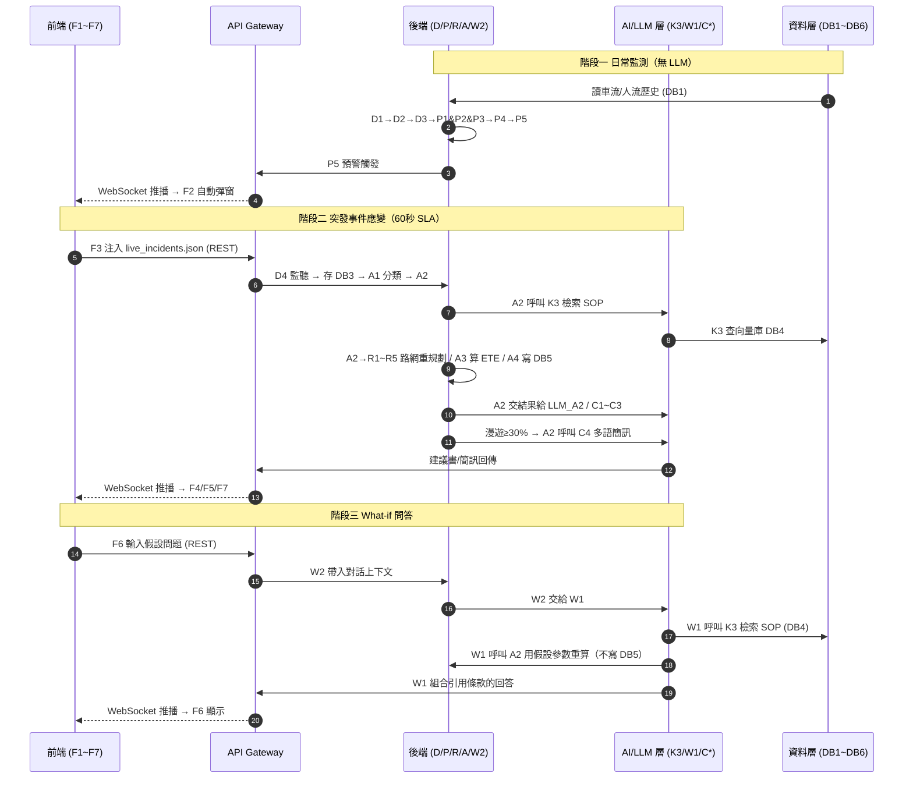

# 智慧交通決策中樞 — 整體資料流情境說明

> 搭配 `模組架構圖_整合版.md` 第四節的內嵌邏輯藍圖閱讀；新版資料實作圖（五 JSON + REST/WebSocket）另見 `diagrams/architecture-json-live.svg`。
> 本文用**一則真實事故**從頭到尾走一遍，讓你看清資料在「前端 → 後端 → AI 層 → 資料層」之間怎麼流動。
>
> 閱讀約定：
> - `A ──> B`：A 把資料送給 B（單向）
> - `A <──> B`：A 與 B 來回問答 / 讀寫（雙向）
> - 每步都標出**經過哪些節點**與**帶著什麼資料**

---

## 情境設定

本情境完全採用 `data/` 五個 canonical JSON 中的真實資料，不使用虛構數值：

```
時間：2026-05-20 22:10
地點：光復南路與忠孝東路口南側
事件：TPE_2026_ACC_001 路面塌陷（live_incidents.json 第 1 筆）
      affected_segment = RD_TPE_002 / Closed / Critical
現場：RD_TPE_002 飽和度 1.0（A 級）、車速 2 km/h、Accident_Impact
背景：大巨蛋散場中（22:00 User_Count 22000、Growth_Rate -0.31，較歷史峰值 40000 大幅下滑）、BS_MRT_BL17 人潮上升、BS_TPE_101／BS_XY_ATT 一帶漫遊比率偏高（分別約 0.40／0.30）
```

> [2026-07-28 更正；2026-07-28再更正筆數] 人流資料已由主辦方補齊真實 `signaling_crowd_density.csv`（36 筆、9 站，時間點不規則；原寫37筆是 `wc -l` 把標題列算進去的計算失誤），取代原本 GPT 生成、標示 `Is_Simulated=true` 的模擬版本。以下內容已依真實資料更新。

整個系統會經歷三條資料流，依序發生：

| 階段 | 資料流 | 對應模組 | 觸發者 |
|---|---|---|---|
| 階段一 | 日常監測迴圈 | 模組1 | 系統自動（背景輪詢） |
| 階段二 | 突發事件應變 | 模組2·4·5 | 指揮官注入事件 |
| 階段三 | What-if 問答 | 模組3 | 評審現場提問 |

---

## 階段一：日常監測迴圈（事故發生前，系統自己在跑）

> 這條迴圈全程**不需要 LLM**，是純後端 + 資料層的即時運算。後端每 5~15 秒推進一次時間軸並以 WebSocket 推播結果（依 R9）；前端不主動輪詢，只有在 WebSocket 斷線時才退回輪詢 `GET /api/dashboard`。

### 資料怎麼流

```
DB1(時序資料庫)
   │  讀歷史車流/人流
   ▼
D1(Loader) ──> D2(Schema校驗) ──> D3(時間標準化)
   │
   ▼  正規化後的乾淨資料，同時分給三個感知模組
D3 ──> P1(飽和度監測) & P2(人流成長率) & P3(漫遊比率)
   │
   ▼  三個指標一起送進規則引擎
P1 & P2 & P3 ──> P4(SOP規則引擎：門檻→條款→動作)
   │
   ▼
P5(事件級別判定 A/B級)
   │  一旦爆表
   ▼  預警觸發（後端主動推，不等前端問）
API ──> FWS ──> F1(時序圖表更新) / F2(異常自動彈窗)
```

### 這一步在做什麼

1. `D1` 從 `DB1` 讀進車流與人流歷史，`D2` 檢查欄位格式對不對，`D3` 把時間統一標準化。
2. 乾淨資料**同時**餵給 `P1`（飽和度）、`P2`（人流成長率）、`P3`（漫遊比率）三個並行的感知模組。
3. 三個指標一起丟給 `P4 SOP 規則引擎`，比對 SOP 門檻，`P5` 判定當前是否達到 A/B 級。
4. 22:00～22:10 間，`P1` 算出 `RD_TPE_002` 飽和度達 `1.0`（≥0.95 → **A 級**）、`P3` 算出 `BS_TPE_101` 漫遊達 `0.40`（≥0.30，SOP 第 6 條成立）→ `P5` 發出**預警觸發**，經 `API → FWS` 以 WebSocket 推到前端，`F2` 自動彈窗（指揮官不用主動查詢，這正是命題模組 1 的要求）。

> 單位提醒 [2026-07-28 更正]：真實資料的 `Roaming_User_Pct` 是**帶 % 符號的字串**（例如 `"40%"`），**D1~D3 正規化階段**須先移除 `%` 再除以 100 才能比對門檻（"40%" → 0.40）；`Growth_Rate` 原始已是小數率（例如 `-0.31`），不可重複轉換。這是最容易造成 SOP 第 6 條全面誤判的地方。

> 關鍵：資料層讀寫還有一條旁路 `P1 & P2 & P3 <──> DB1`，感知模組計算成長率時要回查歷史基準值。

---

## 階段二：突發事件應變（60 秒 SLA 的主戰場）

> 這是最複雜的一條流，橫跨四大層。指揮官注入事故後，系統必須在 **60 秒內**完成重規劃並回傳。

### 資料怎麼流（總覽）

```
F3(事件注入面板)
   │  選取 live_incidents.json 中的 TPE_2026_ACC_001
   ▼  REST POST 送出
FWS ──> API ──> D4(事件注入監聽器)
   ├──> DB3(事件記錄庫)          ← 先存檔留底
   └──> A1(事件分類器)            ← Closed + Critical + RD_* = SOP 第2條
          │
          ▼
        A2(Agent Orchestrator)  ★總指揮（LLM 選工具），以下同時展開
```

`A2` 拿到 `A1` 的事件分類 + `P5` 的事件級別後，**同時**指揮四路人馬：

```
(a) 檢索 SOP 原文
    A2 <──> K3(RAG檢索) <──> DB4(SOP向量庫)

(b) 路網重規劃（生產線 R1~R5）
    A2 ──> R1(建圖) <──> DB2(路網圖) & DB6(Redis快取)
    R1 ──> R2(上下游判定) ──> R3(候選路徑篩選)
       ──> R4(主/次疏散路徑) ──> R5(排除理由記錄) ──> A4

(c) 計算恢復時間
    A2 ──> A3(ETE規則式計算) ──> A4

(d) 決策留痕
    A4(Decision Trace Logger) ──> DB5(稽核庫)
```

算完後，`A2` 把**結構化結果**交給 AI 層寫成人話：

```
A2 <──> LLM_A2(推理LLM)              ← 把判定轉成解釋敘述（模組4解釋鏈）
A2 ──> C1(交控建議書) & C2(號誌配時) & C3(跨系統聯動)
A2 ──|漫遊≥0.30|──> C4(多語簡訊)      ← BS_TPE_101 達 0.40，觸發多語簡訊
```

本情境的實際計算結果（可作為 Demo 驗收基準）：

```
主要路線  RD_TPE_004（容量 2500、飽和 0.78、上游且直接相交）
次要路線  RD_TPE_005（容量 4000、飽和 0.65、下游且直接相交）
排除      RD_TPE_006（非直接相交）、RD_TPE_008（容量 600 且非直接相交）
ETE       60 + (1.0 - 0.5) × 60 = 90 分鐘 → 恢復 23:40
命中條款  SOP-1（A級）、SOP-2（封閉分流）、SOP-6（多語）、SOP-7（ETE）
```

最後全部回傳前端：

```
C1 & C2 & C3 & C4 ──> API
LLM_A2 ──> API
A4 ──> API
   │
   ▼
API ──> FWS ──> F4(路徑地圖) / F5(建議書·簡訊卡片) / F7(決策依據)
```

### 這一步的資料流重點

1. **入口單一**：事故 JSON 一定從 `F3 → API → D4` 進來，`D4` 先寫 `DB3` 存檔，再交給 `A1` 分類。
2. **A2 是樞紐**：它不自己算，而是「派工」——同時叫 RAG 查 SOP、叫路網組算路、叫 ETE 算恢復時間。這也是為什麼圖上 A2 的箭頭最多。
3. **三層決定要分清**：`A2` 這一層是 LLM，負責**決定呼叫哪些工具**；`R1~R5`、`P4`、`A3` 是決定性演算法，負責**算出路線／級別／ETE**；`LLM_A2 / C1~C4` 是 LLM，只負責**寫成人話**。LLM 可以選工具、可以表達，但不得產生或修改事實。
4. **飽和預設排除、唯一候選才例外保留**：排除條件為封閉、容量 <1000、非候選、非直接相交、僅下游、流向不符，以及飽和度 ≥0.85（順命題「避開飽和路段」）。但若飽和候選是**唯一**符合「容量 ≥1000 + 直接相交 + 上游」者，依 SOP 第 2 條保留為主線、記 `saturated_but_retained`，並加上「長綠燈／綠燈延長 25%」，避免回傳空路線。
5. **多語簡訊的觸發**：閘門條件是 `P3` 的漫遊比率 ≥ `0.30`，但實際呼叫掛在 `A2`——因為簡訊要帶事故位置、類型、ETE、改道路線，這些只有 A2 手上有。本情境 `BS_TPE_101` 達 `0.40`、`BS_XY_ATT` 達 `0.30`，所以中/英（加分日/韓）簡訊全開（`BS_TPE_DOME` 真實漫遊率僅約 0.05~0.06，不再是觸發依據）。

---

## 階段三：What-if 問答（評審現場互動）

> 評審在 Dashboard 對話框問假設性問題，這條流的重點是：**不能讓 LLM 自己編 SOP 條款**。

### 資料怎麼流

```
F6(對話視窗)
   │  輸入：「如果 BL17 人數再增加到 40000 會怎樣？」
   ▼
API ──> W2(對話狀態管理)      ← 只帶入對話上下文，不做判定
   │
   ▼
W1(What-if 問答 LLM)  ★真正的執行者
   ├──> K3(RAG檢索) <──> DB4   ← 檢索相關 SOP 條款原文
   └──> A2(Orchestrator)       ← 用假設參數 40000 重跑一次判定（僅模擬，不寫 DB5）
   │
   ▼  組合「觸發條款 + 預期動作 + 跨系統措施」
W1 ──> API ──> FWS ──> F6 顯示回答
```

### 這一步的資料流重點

1. **W2 只是記憶體**：`W2 對話狀態管理` 負責記住多輪對話上下文（前面問過什麼、假設參數是什麼），它**不做推理、不查 SOP**，只是把整理好的問題交給 `W1`。
2. **W1 才是執行者**：檢索（呼叫 K3）、重算（呼叫 A2）、組答案，全部是 W1 在做。
3. **重算走 A2、不走 W2**：假設參數的重新判定是 `W1 <──> A2`，用後端規則引擎重算一次，確保回答有據可查。這也是模擬性質，**不會寫進正式稽核庫 DB5**。
4. **答案有憑有據**：W1 最後引用「BL17 達 40000 → 觸發 SOP 第 3 條 → 建議過站不停 / 接駁分流」，條款來自 K3 檢索、數字來自 A2 重算。

---

## 資料的保存：哪些資料會寫進資料庫？

前面三個階段講的是「資料怎麼流」，但很多人會漏掉一個問題：**這些資料流過去之後，有沒有被存下來？** 這裡一次講清楚。

### 六個資料庫的讀寫角色

| 資料庫 | 讀 / 寫 | 存什麼 | 誰負責寫入 | 競賽版實作對應 |
|---|---|---|---|---|
| `DB1` 時序資料庫 | **讀為主** | 車流 112 筆／人流 36 筆（真實資料，2026-07-28更正；筆數於同日再更正） | 資料匯入管線（離線/定時） | `city_traffic_flow.json`、`signaling_crowd_density.csv` |
| `DB2` 路網圖資料庫 | **唯讀** | 15 路段、容量、替代路線 | 離線建置 | `road_network_topology.json` |
| `DB3` 事件記錄庫 | **寫** | 3 筆事件注入歷史 | `D4` 事件監聽器 | `live_incidents.json` + 記憶體 |
| `DB4` Vector Store | 讀（查）／寫（建索引） | SOP 條款 embedding | `K1`（離線索引） | Bedrock KB + S3 Vectors（唯一必須上雲的資料庫） |
| `DB5` Decision Log | **寫** | 決策軌跡、排除理由 | `A4` Trace Logger | 記憶體／檔案（DynamoDB 選配） |
| `DB6` Cache/Redis | **讀寫** | 路網常駐記憶體 | `R1` Graph Builder | Python 記憶體，不架 Redis |

> SOP 的 source of truth 是 `emergency_traffic_sop.json`（7 sections）；`K1` 是把它衍生成索引文件後上傳，`DB4` 存的是衍生向量，不是原始 JSON。
>
> 上雲範圍補充：`DB4` 是唯一必須上雲的**資料庫**；此外 S3 會存放 SOP 索引文件，`DB5` 若選用 DynamoDB 也會上雲。五個原始 JSON 留在 repo，由 FastAPI 直接讀取。

一句話分類：

- **唯讀 / 事前準備好的**：`DB1`（歷史數據）、`DB2`（路網圖）、`DB4`（SOP 向量庫）——這些是系統「查資料」用的知識來源，運行時基本只讀不改。
- **運行時才寫入的**：`DB3`（事件一注入就存）、`DB5`（決策一完成就留痕）、`DB6`（路網算完快取起來）。

### 已定案：DB5 存的是「完整 DecisionResult」

> **實作規則（本節結論已定案，實作請直接照此做）**：`A4` 寫入 `DB5` 的內容是**整份 `DecisionResult`**，而非只有推理軌跡。因為 `DecisionResult` 本身已包含 `control_center_report`（建議書全文）與 `notifications[]`（各語言簡訊全文），所以生成內容自然一併留存，不需要額外的回寫線。
>
> 對應到 `diagrams/architecture-json-live.svg`，就是 `A4 → 決策軌跡儲存` 那條線；競賽版落地為記憶體／本機 JSON 檔，DynamoDB 為選配。

以下說明這個決定的來由（背景閱讀，非待辦事項）。看階段二最後那段：

```
C1 & C2 & C3 & C4 ──> API ──> FWS ──> 前端
LLM_A2 ──> API ──> FWS ──> 前端
```

生成出來的**交控建議書、多語簡訊、解釋敘述**目前是**直接推到前端就結束了，沒有寫回任何資料庫**。`A4 --> DB5` 存的只是「決策軌跡與排除理由」（也就是**為什麼**這樣判），但**最後真正產出、真正發給民眾的文字內容**並沒有存下來。

這會造成兩個問題：

1. **無法回放**：模組 4 的 `F7 決策依據面板` 若要重現一小時前的某次事件，只能拿到推理軌跡，拿不到當時實際發出的建議書/簡訊全文。
2. **稽核斷鏈**：發給公眾的簡訊（尤其多語版）屬於對外正式訊息，事後檢討 / 法遵通常要求留存，但目前沒有落地保存。

### 做法：等 `DecisionResult` 組完才寫 DB5

因此寫入時機很明確——**不是算完路線就寫，而是等建議書與簡訊都生成、`DecisionResult` 組裝完成後才寫一次**：

```
A2 ──> C1/C2/C3/C4 生成完成
   ──> api_orchestrator 組裝完整 DecisionResult
   ──> A4 ──> DB5（一個 event_id 一筆完整記錄）
```

這樣 `DB5` 的每一筆就是一份**完整可追溯記錄**：

```
一筆 Decision Log 記錄 =
   event_id（哪個事件，來自 DB3）
 + 判定級別 + 使用了哪些數據（P 系列）
 + 主/次疏散路徑 + 排除理由（R 系列）
 + ETE（A3）
 + 最終建議書全文（C1~C3）
 + 實際發出的多語簡訊全文（C4）
 + 產生時間戳
```

這樣 `F7` 回放、事後稽核、甚至 A/B 檢討「同一事件不同版本建議」都有據可查。

### What-if 的產出「故意」不保存

要特別區分：階段三 What-if 的重算結果與回答，是**刻意不寫進 DB5** 的。

原因是 What-if 屬於「假設模擬」，評審問「如果人數變 40000 呢」並不是真實發生的事件。若把模擬結果混進正式稽核庫，會污染真實決策記錄。所以：

- 正式事件應變（階段二）→ **寫 DB5**（要留痕）
- What-if 模擬（階段三）→ **不寫 DB5**（僅記在 `W2` 的對話 session 上下文，對話結束即可拋棄）

> 小結：**唯讀的是知識（DB1/DB2/DB4），運行時要寫的是事實與決策（DB3/DB5/DB6）**；`DB5` 存整份 `DecisionResult`（含建議書與簡訊全文），寫入時機為 `DecisionResult` 組裝完成後，且 What-if 模擬明確排除在外。

---

## 三階段合起來看：一張資料流總表

| 步驟 | 起點 | 終點 | 帶什麼資料 | 協定/方式 |
|---|---|---|---|---|
| 0 | data/ 五個 JSON | D1 | raw 車流/人流/路網/事件/SOP | 檔案讀取 |
| 1 | DB1 | D1→D2→D3 | 欄位映射、時區、Roaming÷100 | 後端讀取 |
| 2 | D3 | P1 & P2 & P3 | 正規化時序資料 | 後端內部 |
| 3 | P1~P3 | P4 → P5 | 飽和度/成長率/漫遊比率 | 後端內部 |
| 4 | P5 | API → FWS → F1/F2 | 預警觸發 | WebSocket 推播 |
| 5 | F3 | API → D4 | live_incidents.json | REST 請求 |
| 6 | D4 | DB3 / A1 → A2 | 事件存檔 + 分類 | 後端內部 |
| 7 | A2 | K3 ↔ DB4 | SOP 語義檢索 | 後端呼叫 AI 層 |
| 8 | A2 | R1→R2→R3→R4→R5 | 路網重規劃 | 後端內部（讀 DB2/DB6） |
| 9 | A2 | A3 → A4 → DB5 | ETE + 決策留痕 | 後端內部 |
| 10 | A2 | LLM_A2 / C1~C4 | 生成建議書/簡訊 | 後端呼叫 AI 層 |
| 11 | C1~C4/LLM_A2/A4 | API → FWS → F4/F5/F7 | 結果推播 | WebSocket 推播 |
| 12 | F6 | API → W2 → W1 | What-if 問題 | REST 請求 |
| 13 | W1 | K3 ↔ DB4 / A2 | 檢索 + 模擬重算 | AI 層呼叫 |
| 14 | W1 | API → FWS → F6 | 引用條款的回答 | WebSocket 推播 |

---

## 一句話記住整體資料流

> **資料層存東西 → 後端洗資料、算指標、判級別、規劃路徑 → AI 層檢索 SOP 並寫成建議書/簡訊 → 前端顯示，並支援互動問答。**
>
> 所有前後端往來都經過 **API Gateway** 這個唯一入口：**前端用 REST 打進來、後端用 WebSocket 推回去**，兩者由同一個 FastAPI Server 提供（`/api/*` 與 `/ws`）。而 **A2 Orchestrator** 是後端的總指揮，看不懂圖的時候，先找到 A2，再看「誰餵它、它叫誰」，資料流就通了。
>
> 再記一句就夠：**A2 的 LLM 決定叫誰，Python 工具算出答案，另一批 LLM 把答案寫成人話。**

---

## 附：資料流時序圖（可在 Preview 檢視）


