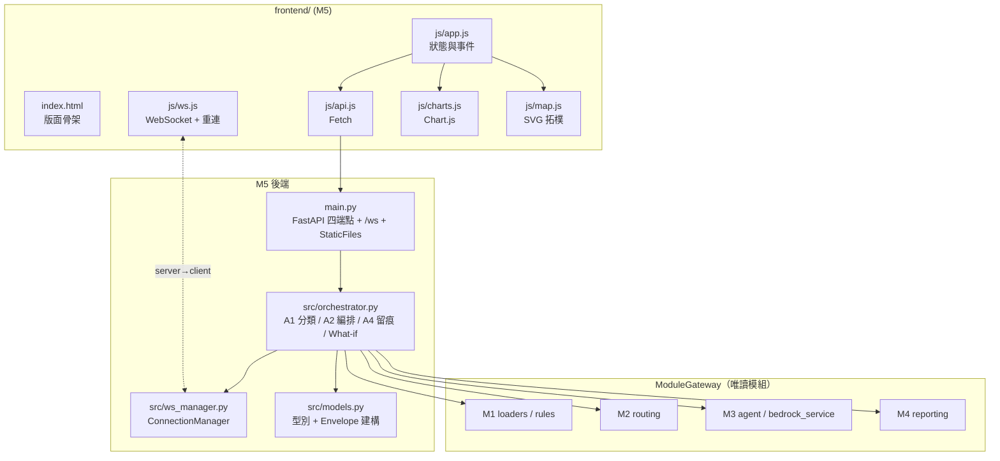
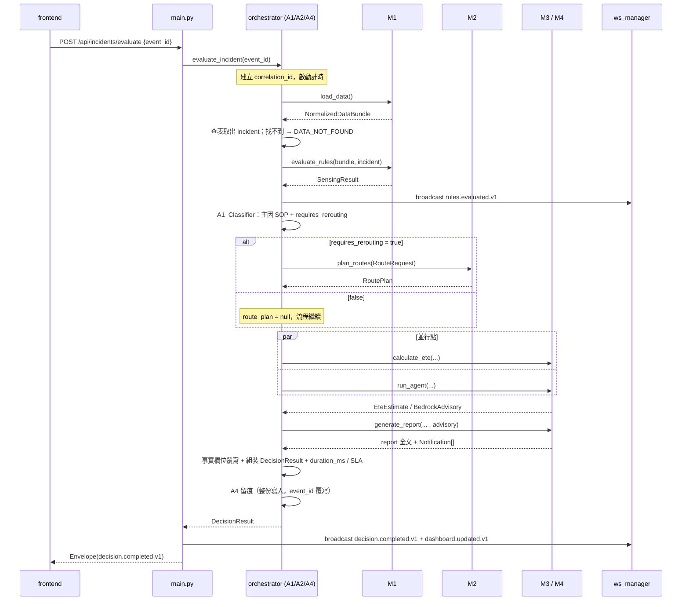

# Design Document — M5 決策編排、API 與 Dashboard

## 前提（引用來源，本文件不重述）

本文件只描述 M5 自己的設計決策。下列內容已由 steering 與機器契約定義，本文件**一律以引用取代重述**：

| 主題 | 權威來源 |
|---|---|
| Message Envelope 欄位、錯誤碼九種、provenance 分類、留痕原則 | `.kiro/steering/02-data-contract.md` 第 7 節 |
| 正規化與單位換算 | `.kiro/steering/02-data-contract.md` 第 2 節 |
| Join 與 as-of 時間對齊 | `.kiro/steering/02-data-contract.md` 第 3 節 |
| A/B 級門檻、severity、SOP 門檻數值 | `.kiro/steering/02-data-contract.md` 第 4 節 |
| 路網篩選與飽和兩段式規則 | `.kiro/steering/02-data-contract.md` 第 5 節 |
| ETE 公式與三筆事件固定驗收值 | `.kiro/steering/02-data-contract.md` 第 6 節 |
| 前端顯示色彩與 Demo 標示規則 | `.kiro/steering/02-data-contract.md` 第 8 節 |
| 技術棧、API 表面、環境變數、保底模式 | `.kiro/steering/00-tech-stack.md` 第 1、4、5、6 節 |
| 模組所有權、決策職責三層、固定資料流向 | `.kiro/steering/01-module-boundaries.md` 第 1–4 節 |
| 所有型別的欄位、必填性與列舉值 | `contracts/module_exchange_contract.json` 的 `$defs` |

本文件提到型別時**只用型別名**，不展開欄位。

---

## Overview

M5 是整合層，回答六件事：

1. M5 對外呼叫 M1–M4 的邊界函式簽章，以及開發初期的 stub 介接方式。
2. 四個 REST 端點與 `/ws` 的請求／回應對應。
3. `orchestrator` 的編排時序，含並行點與超時處理。
4. `ws_manager` 的 `ConnectionManager` 設計與廣播時機。
5. 前端檔案職責分工與版面分區。
6. 失敗保底策略矩陣。

設計上的核心決策：**M5 不含任何判定邏輯**。`orchestrator.py` 內只有三類程式碼——呼叫下游的 gateway、組裝 Envelope 與 `DecisionResult` 的搬運程式、量測與錯誤收斂。A1 事件分類是唯一的例外，它是查表式的路由決定（決定要不要呼叫 M2、主因 SOP 是哪一條），不重算任何級別或門檻。

M5 擁有 `main.py`、`src/models.py`、`src/orchestrator.py`、`src/ws_manager.py`、`frontend/**`；其餘 `src/*.py`、`prompts/**`、`data/**` 為唯讀。

---

## Architecture



節點對照：`main.py` = API Gateway；`orchestrator.py` 內含 A1 事件分類器、A2 編排、A4 Decision Trace Logger；`ws_manager.py` = FWS；`frontend/**` = F1–F7。

---

## Components and Interfaces

### 1. 對外邊界：`ModuleGateway`

M5 不直接 import 其他模組的內部函式。`orchestrator.py` 宣告一個 `typing.Protocol`，把 M1–M4 的公開入口收斂成六個邊界函式；真實模組與 stub 都實作同一個 Protocol，因此第 5 節的「只換來源不換格式」在型別層即被保證。

```python
# src/orchestrator.py（M5 擁有）
from typing import Protocol
from src.models import (
    NormalizedDataBundle, SensingResult, RouteRequest, RoutePlan,
    EteEstimate, Notification, BedrockAdvisory, ScenarioOverrides,
    Incident, DecisionResult, WhatIfResult,
)

class ModuleGateway(Protocol):
    # --- M1 資料感知與規則（src/loaders.py, src/rules.py）---
    def load_data(self) -> NormalizedDataBundle: ...
    def evaluate_rules(
        self,
        bundle: NormalizedDataBundle,
        incident: Incident | None = None,
    ) -> SensingResult: ...

    # --- M2 事件與路網規劃（src/routing.py）---
    def plan_routes(self, request: RouteRequest) -> RoutePlan: ...

    # --- M4 ETE、建議書與通報（src/reporting.py）---
    def calculate_ete(
        self,
        incident: Incident,
        bundle: NormalizedDataBundle,
    ) -> EteEstimate: ...
    def generate_report(
        self,
        incident: Incident,
        sensing: SensingResult,
        route_plan: RoutePlan | None,
        ete: EteEstimate,
        advisory: BedrockAdvisory | None,
    ) -> tuple[str, Notification | None]: ...
    # [2026-07-28更正] 第二個回傳值原寫 list[Notification]，改為單一物件（{zh, en?, ja?, ko?}），
    # 對齊 SPEC-O3 DecisionResult.notifications 的形狀；SOP-6 未觸發時只有 zh 有值。

    # --- M3 Agent、RAG 與 What-if（src/agent.py, src/bedrock_service.py）---
    def run_agent(
        self,
        incident: Incident,
        sensing: SensingResult,
        route_plan: RoutePlan | None,
        ete: EteEstimate,
    ) -> BedrockAdvisory: ...
    def parse_whatif(self, question: str) -> ScenarioOverrides: ...
    def narrate_whatif(
        self,
        question: str,
        result_facts: WhatIfResult,
    ) -> tuple[str, list]: ...
```

設計理由與約束：

- **事實只往一個方向流。** `run_agent` 與 `narrate_whatif` 的輸入都是已經算完的 Python 事實物件，回傳只採用敘述類欄位；M5 組裝時以 Python 事實覆蓋同名欄位（需求 4.6）。
- **`generate_report` 一次回傳報告全文與 `Notification` 清單**，避免 M5 需要知道 C1–C4 的內部拆分。多語判定由 M5 依 SOP-6 門檻結果決定是否要求多語，門檻值本身向 M1 的 `SensingResult` 取得，不在 M5 比較。
- **`narrate_whatif` 的第二個回傳值是 `SopEvidence` 清單**，因為任何 LLM 回答至少要附一筆依據。

### 2. 開發初期的 stub 介接

Day 1 上午 M1–M4 尚未存在，因此 gateway 有兩個實作，選擇方式為**兩段式**：先看環境變數 `USE_STUB_MODULES`，為 `true` 時直接回傳 `StubGateway`（手動強制假資料，供前端在其他模組未完成時獨立開發）；為 `false` 時才嘗試 import 真實模組，import 失敗才個別降級為 stub 並記 warning。

```python
# src/orchestrator.py
def build_gateway() -> ModuleGateway:
    if os.getenv("USE_STUB_MODULES", "false").lower() == "true":
        _STARTUP_WARNINGS.append("module_stub_in_use:forced")
        return StubGateway()
    try:
        from src import loaders, rules, routing, reporting, agent  # noqa
        return LiveGateway()
    except ImportError as exc:
        _STARTUP_WARNINGS.append(f"module_stub_in_use:{exc.name}")
        return StubGateway()
```

- `StubGateway` 位於 `src/orchestrator.py` 內（不新增檔案），回傳以 `models.py` 建構、通過機器契約驗證的假資料，事件相關欄位取自 `available_incidents` 的三筆 ID。
- `StubGateway` **不讀 `data/**`**（那是 M1 的權限），假資料為硬編常數。
- 每個 stub 呼叫都在 Envelope `warnings` 留下 `module_stub_in_use:<module>`，避免 Demo 時誤以為是真實結果。
- `USE_STUB_MODULES=true` 時 warning 改記為 `module_stub_in_use:forced`，讓畫面能區分「模組缺失被迫使用」與「手動強制使用」。
- 混合狀態合法：M1、M2 已完成而 M4 未完成時，`LiveGateway` 對缺失模組個別降級為 stub 方法。

### 3. `main.py`：端點與 payload 對應

| 端點 | 請求 | `message_type` | 回應 `payload` |
|---|---|---|---|
| `GET /api/dashboard` | 無 | `dashboard.updated.v1` | `DashboardPayload` |
| `POST /api/incidents/evaluate` | `{ "event_id": str }` | `decision.completed.v1` | `DecisionResult` |
| `POST /api/what-if` | `WhatIfRequest` | `whatif.evaluated.v1` | `WhatIfResult` |
| `GET /api/health` | 無 | 不使用 Envelope | `{ status, use_bedrock, gateway_mode }` |
| `WS /ws` | 無（伺服器單向送出） | `rules.evaluated.v1` / `dashboard.updated.v1` / `decision.completed.v1` / `whatif.evaluated.v1` | 依 `message_type` 對應 `SensingResult` / `DashboardPayload` / `DecisionResult` / `WhatIfResult` |

- `GET /api/health` 的 `gateway_mode` 反映當前 gateway 來源：全部為 stub（含 `USE_STUB_MODULES=true` 強制）時為 `stub`，全部為真實模組時為 `live`，部分模組降級時為 `mixed`。
- `source_module` 固定 `api_orchestrator`；`target_module` 固定 `dashboard`。
- 三個 Envelope 端點共用一個 FastAPI 例外處理器，把例外收斂成 `status="error"` 的 Envelope，錯誤碼只取契約定義的九種。
- `frontend/` 以 `StaticFiles(html=True)` 掛在 `/`，因此 API 前綴 `/api` 與 `/ws` 不會被靜態路由吃掉。
- `POST` 一律同步回傳完整結果；WebSocket 推播是附加動作，其失敗不改變 REST 回應（需求 2.10、6.8）。

### 4. `orchestrator.py`：編排時序



順序與並行的理由：

- **A1 在 `evaluate_rules` 之後**。分類需要 `SensingResult` 的 `rule_hits` 才能區分主因與並行命中；分類本身只做查表，不重算門檻。
- **唯一的並行點是 `calculate_ete` 與 `run_agent`**。ETE 只依賴事件與 bundle，advisory 只依賴已完成的事實，兩者互不相依，用 `asyncio.gather` 併發以壓低 `duration_ms`。
- **`generate_report` 必須在 advisory 之後**，因為報告全文要能引用 advisory 的敘述；advisory 不可用時退回模板（需求 4.8）。
- **A4 留痕在組裝之後、回應之前**，且留痕失敗只加 warning。
- **超時處理**：每個 gateway 呼叫包在 `asyncio.wait_for` 內，逾時上限由 orchestrator 常數集中定義（M1／M2 較短，M3 較長，總預算對齊 `within_60_second_sla` 的 60000ms）。逾時的處置分兩級——`load_data` 或 `evaluate_rules` 逾時無法產出任何事實，回 `status="error"` + `TIMEOUT`；`plan_routes`／`calculate_ete`／`run_agent`／`generate_report` 逾時則該欄位留 null 或改用模板，回 `status="partial"` + `TIMEOUT`，並在 `warnings` 記錄逾時模組。`duration_ms` 一律照實填寫，`within_60_second_sla` 依實測值判定，不因超時而省略回應。

What-if 分支時序：

```text
POST /api/what-if
  → 驗證 scenario_overrides 非空（空 → VALIDATION_ERROR）
  → M3.parse_whatif(question) → ScenarioOverrides
  → 合併 request 帶入的 overrides（request 優先）
  → bundle = deepcopy(M1.load_data()) 後套用 overrides（記憶體副本）
  → M1.evaluate_rules / M2.plan_routes / M4.calculate_ete 重算
  → 與 base_decision_id（或 base_as_of 現況）比對 → differences_from_base
  → M3.narrate_whatif(...) → answer + SopEvidence[]
  → simulation_only = true；不呼叫 A4；不寫 data/
  → 回應 + broadcast whatif.evaluated.v1
```

### 5. `ws_manager.py`：`ConnectionManager`

```python
class ConnectionManager:
    def __init__(self) -> None:
        self._active: set[WebSocket] = set()

    async def connect(self, websocket: WebSocket) -> None: ...
    def disconnect(self, websocket: WebSocket) -> None: ...
    async def broadcast(self, envelope: dict) -> int: ...
```

- **狀態**：以 `set` 保存使用中連線；`disconnect` 對不存在的連線是無操作，因此重複移除安全。
- **廣播**：逐一送出，任何連線送出時拋出例外即從 `set` 移除並繼續其餘連線；回傳成功送達數。連線集合為空時直接回 0，不視為錯誤。
- **單向**：`/ws` 端點在迴圈中 `receive_text()` 只為偵測斷線，收到的內容丟棄。
- **廣播時機**（[2026-07-28更正] 原寫「唯一四處」，核對 `SPEC-O3` §5 後發現遺漏三種——`SPEC-O3` 定義的 `alert`／`cycle_start`／`task_update` 三種 WS 事件在此文件的廣播清單裡完全沒有對應觸發點，導致 F2 異常自動彈窗、Agent 活動面板兩個畫面功能沒有推播來源可用。已補齊為七處，並把 `SPEC-O3` 原寫的 `decision.result.v1` 統一改名為本文件既有的 `decision.completed.v1`——同一個 `DecisionResult` 推播不能有兩個名字，`models.py` 是唯一定義處，以此處命名為準）：

| 時機 | `message_type` | payload |
|---|---|---|
| `evaluate_rules` 回傳後（含異常預警） | `rules.evaluated.v1` | `SensingResult` |
| P5 判定 B→A 或 normal→B 級轉換時 | `decision.alert.v1` | `{level, description, ete_minutes}` 摘要（觸發 F2 自動彈窗） |
| 決策週期開始（`open_trace` 之後） | `decision.cycle_start.v1` | `{trace_id, triggered_by}`（Agent 活動面板顯示週期啟動） |
| 每次 `record_step(action="DISPATCH"／完成／逾時)` 時 | `decision.task_update.v1` | `{trace_id, dispatch_seq, status}`（Agent 活動面板即時狀態） |
| `DecisionResult` 組裝並留痕後 | `decision.completed.v1` | `DecisionResult` |
| 決策完成後、或 `GET /api/dashboard` 造成現況變動時 | `dashboard.updated.v1` | `DashboardPayload` |
| What-if 完成後 | `whatif.evaluated.v1` | `WhatIfResult` |

推播內容與同一流程 REST 回應共用同一個 `correlation_id` 與同一份 payload 物件，前端因此可以用任一來源更新畫面。`decision.alert.v1`／`decision.cycle_start.v1`／`decision.task_update.v1` 三者由 `orchestrator.py`（`m4-explanation-chain-and-orchestrator` 核心邏輯）在對應時機呼叫 `ws_manager.broadcast()`，`ws_manager.py` 本身只負責連線管理與送出，不判斷何時該推播。

### 6. 前端檔案職責與版面分區

| 檔案 | 職責 | 不得做的事 |
|---|---|---|
| `frontend/index.html` | 版面骨架、六個分區容器、What-if 對話框與事件注入 Modal 的 DOM | 不放商業邏輯 |
| `frontend/css/styles.css` | 深色指揮中心主題、CSS Variables 定義級別／路線色彩、Grid 版面 | 不用前端框架 |
| `frontend/js/api.js` | Fetch 四個端點、Envelope 拆封、錯誤碼轉可讀訊息 | 不解讀業務欄位 |
| `frontend/js/ws.js` | WebSocket 連線、指數退避重連、斷線時啟動 `GET /api/dashboard` 輪詢、依 `message_type` 分派 | 不直接改 DOM |
| `frontend/js/charts.js` | Chart.js 車流／人流時序圖與門檻線、Demo 標示 | 不計算 KPI |
| `frontend/js/map.js` | SVG 拓樸圖、依 `display_points` 定位、依 payload 上色 | 不篩路線、不判級別 |
| `frontend/js/app.js` | 單一狀態物件、渲染排程、KPI／決策依據／建議書卡片、載入動畫 | 不判定 `traffic_level`、不算 ETE |
| `frontend/vendor/` | Demo 前落地的 Chart.js | — |

版面分區（CSS Grid，單頁不換頁）：

```text
┌──────────────────────────────────────────────────────────────┐
│ Header：系統名稱 · as_of · 連線狀態燈 · Demo Scenario 標籤     │
├───────────────────────────────┬──────────────────────────────┤
│ F1 KPI 卡片列（5 張）          │ F3 事件注入面板              │
├───────────────────────────────┤ （3 筆 available_incidents） │
│ F4 SVG 路網拓樸圖              ├──────────────────────────────┤
│                               │ F7 決策依據面板              │
├───────────────────────────────┤ （SOP 條款 + 候選理由）       │
│ F1 Chart.js 車流／人流時序圖    ├──────────────────────────────┤
│                               │ F5 建議書／簡訊卡片          │
├───────────────────────────────┴──────────────────────────────┤
│ F6 What-if 對話框（可收合）                                   │
└──────────────────────────────────────────────────────────────┘
F2 異常自動彈窗：收到 rules.evaluated.v1 且含 alerts 時覆蓋顯示
```

渲染規則：`app.js` 只做「payload 欄位 → DOM 文字／class」的映射。級別色彩以 `traffic_level` 值直接對應 CSS class，不在 JS 比較任何門檻。

---

## Data Models

M5 不定義新的資料語意，只做三件事：

1. **把契約 `$defs` 逐一實作為 Pydantic Model**，放在 `src/models.py`。欄位與列舉值以 `contracts/module_exchange_contract.json` 為準，本文件不重列。
2. **提供 Envelope 建構的單一入口**：

```python
# src/models.py
def build_envelope(
    message_type: MessageType,
    payload: EnvelopePayload,
    *,
    correlation_id: str,
    status: EnvelopeStatus = "ok",
    source_module: ModuleName = "api_orchestrator",
    target_module: ModuleName = "dashboard",
    provenance: list[DataProvenance] | None = None,
    warnings: list[str] | None = None,
    errors: list[ErrorDetail] | None = None,
) -> MessageEnvelope: ...
```

`schema_version`、`message_id`、`generated_at` 由函式內產生；`correlation_id` 必須由呼叫方傳入，以保證同一流程共用（需求 1.3、1.4）。

3. **M5 內部私有結構**（不進契約、不跨模組）：

| 結構 | 用途 |
|---|---|
| `ClassificationResult` | A1 輸出：主因 SOP、`requires_rerouting`、受影響路段來源 |
| `DecisionTrace` | A4 記憶體軌跡：`dict[event_id, TraceEntry]`，`TraceEntry` 含整份 `DecisionResult`、工具呼叫順序、引用 `clause_id` 清單 |
| `TimeoutBudget` | 各 gateway 呼叫的逾時常數 |

`ClassificationResult` 與 `DecisionTrace` 定義在 `src/orchestrator.py`，不放入 `models.py`，避免其他模組誤用 M5 私有狀態。

A1 分類對照表（查表，非判定邏輯）：

| `incident.type` | 主因 SOP | `requires_rerouting` |
|---|---|---|
| `Road_Collapse_Accident` | `SOP-2` | true |
| `Crowd_Surge_Injury` | `SOP-3` | false |
| `Power_Failure` | `SOP-5` | false |
| 其他 | 無（僅 warning） | false |

受影響路段來源：有 `affected_road` 用它，否則取 `affected_segment` 中 `RD_` 開頭者；判定順序依 `.kiro/steering/02-data-contract.md` 第 3 節。

> **[2026-07-28 總架構師補註]** `m2-incident-routing/模組2B_事件分類與本機流程協調_第一階段Spec.md` 的「A1 規則分類」表對同樣三種事件類型寫的是條件式判斷（`Crowd_Surge_Injury`／`Power_Failure` 在有 `affected_road`／道路ID 時才規劃道路，不是無條件 false）。這裡的表格已經被 `Property 10`（Correctness Properties 節）formalize 成正式驗收條件，是整合後「orchestrator 要不要呼叫 `plan_routes()`」的權威判斷——`m2-incident-routing` 是 Phase 1 獨立沙盒開發（見該資料夾內已加註的整合收斂說明），其內部「是否規劃道路」欄位屬於沙盒期間的簡化版本，整合後以本表為準，不需要照抄 M2-B 的條件式邏輯。
>
> **[2026-07-28 二次補註 — 已對照 SOP 原文確認]** 讀過 `data/emergency_traffic_sop.json` 原文：SOP-3（捷運與接駁分流）處置內容是「建議北捷過站不停、通知公車處調度接駁專車、引導群眾步行至 BS_MRT_BL18」，SOP-5（號誌故障應變）處置是「產出人工指揮派遣建議」——**兩條都完全沒有路段層級改道的內容**，都是轉運/人工指揮手段，不涉及 R1-R5 路網重規劃。這證實本表的「無條件 false」才是跟 SOP 語意一致的正確版本，`m2-incident-routing` 的條件式判斷反而是不必要的過度概化，不用照抄。另外，SOP-2（車禍與路障應變）的實際觸發條件是 `status∈{Closed,Blocked,Restricted} AND severity∈{High,Critical} AND affected_segment以RD_開頭`，不是單純比對 `incident.type`；本表用 `Road_Collapse_Accident` 型別查表能讓 `data/live_incidents.json` 的三筆固定事件跑出正確黃金值，但若未來事件型別不是這三種固定值、卻符合上述條件，本表會漏判——這是刻意的 Demo 範圍簡化，不是通用的 SOP-2 判定引擎，如果之後要支援任意事件輸入，需要改成條件式判斷而非型別查表。

---

## Correctness Properties

*A property is a characteristic or behavior that should hold true across all valid executions of a system—essentially, a formal statement about what the system should do. Properties serve as the bridge between human-readable specifications and machine-verifiable correctness guarantees.*

M5 的可測核心是「搬運是否忠實」：Envelope 是否合約、事實欄位是否被改動、狀態是否只在該變的時候變。以下性質皆可在不呼叫 AWS 的情況下以假 gateway 執行。前端視覺呈現（Chart.js 門檻線、SVG 上色、瀏覽器重連）不列為性質，改以 Demo 檢核清單處理。

### Property 1: Envelope 與 payload 契約一致性

*對任意* 合法的 `message_type` 與對應 payload 組合，`build_envelope` 產生的 Envelope 以及四個 REST 端點的回應皆應通過 `contracts/module_exchange_contract.json` 驗證，且所有時間欄位帶 `+08:00`、`message_id` 互不重複。此性質在 `StubGateway` 與 `LiveGateway` 下皆須成立。

**Validates: Requirements 1.2, 1.3, 1.5, 2.3, 2.4, 2.5, 9.4**

### Property 2: 單一流程共用 correlation_id

*對任意* 事件評估或 What-if 請求，該次流程產生的 REST 回應與所有 WebSocket 推播 Envelope 的 `correlation_id` 應完全相同。

**Validates: Requirements 1.4**

### Property 3: A1 分類等於對照表且幂等

*對任意* `Incident`，A1 分類結果的主因 SOP 與 `requires_rerouting` 應等於 Data Models 節對照表的值；擾動事件的非決策欄位不改變結果；重複呼叫回傳相同結果；分類過程中語言模型呼叫次數為 0。

**Validates: Requirements 3.1, 3.2, 3.3, 3.5, 3.6, 3.8, 3.9**

### Property 4: 受影響路段來源優先序

*對任意* 同時具備 `affected_road` 與 `RD_` 類 `affected_segment` 且兩者不同的事件，A1 選定的受影響路段應等於 `affected_road`。

**Validates: Requirements 3.4**

### Property 5: rule_hits 完整保存

*對任意* `SensingResult.rule_hits` 集合，`DecisionResult.rule_hits` 應為其超集，且主因 SOP 的 `clause_id` 未被改寫。

**Validates: Requirements 3.7**

### Property 6: 錯誤輸入映射到正確錯誤碼且服務存活

*對任意* 不存在的 `event_id`、任意不通過 Pydantic 驗證的請求本體、任意由下游拋出的未預期例外，回應的 `errors[0].code` 應分別為 `DATA_NOT_FOUND`、`VALIDATION_ERROR`、`INTERNAL_ERROR`，且後續請求仍能成功處理。

**Validates: Requirements 2.7, 2.9, 9.8**

### Property 7: 下游失敗降級

*對任意* 下游模組失敗或逾時的子集組合，回應的 `status` 應為 `partial`、`errors` 含對應錯誤碼（`TIMEOUT` / `MODEL_INVOCATION_FAILED` / `KNOWLEDGE_RETRIEVAL_FAILED`）、`warnings` 記錄失敗模組名稱，且已取得的事實欄位仍出現在 `DecisionResult` 中。

**Validates: Requirements 2.8, 4.10, 9.2, 9.3**

### Property 8: 編排呼叫順序

*對任意* 事件，gateway 的呼叫記錄應滿足：`load_data` 早於 `evaluate_rules`，`evaluate_rules` 早於 `plan_routes`，`run_agent` 早於 `generate_report`。

**Validates: Requirements 4.1**

### Property 9: 事實欄位等於下游輸出

*對任意* 下游回傳的 `SensingResult`、`RoutePlan`、`EteEstimate` 組合，`DecisionResult` 的 `traffic_level`、`rule_hits`、`route_plan`、`ete` 欄位應與下游輸出逐一相等。

**Validates: Requirements 4.2**

### Property 10: 不需改道時流程仍完整

*對任意* `requires_rerouting` 為 false 的事件，`DecisionResult.route_plan` 應為 null、未呼叫 `plan_routes`，且 `ete`、`control_center_report`、`notifications` 皆非空。

**Validates: Requirements 4.3**

### Property 11: 多語通報與 SOP-6 門檻雙向對應

*對任意* 站點 `roaming_user_pct` 分布，`notifications` 中出現 `zh-TW`、`en` 以外語言的充分必要條件是至少一個站點達到 SOP-6 門檻。

**Validates: Requirements 4.4, 4.5**

### Property 12: LLM 不得改動事實欄位

*對任意* `BedrockAdvisory`（包含刻意塞入與 Python 事實衝突值的情況），組裝後 `DecisionResult` 的事實欄位應等於 Python 端取得的值，且 `advisory.fact_source` 為 `python_decision_facts`、`sop_evidence` 至少一筆。

**Validates: Requirements 4.6, 4.7**

### Property 13: 不合格 advisory 退回模板

*對任意* 缺少 `sop_evidence` 或敘述未包含 Python 事實值的 advisory，`control_center_report` 與 `advisory` 內容應等於 M4 模板輸出，且 `warnings` 記錄改用模板的原因。

**Validates: Requirements 4.8**

### Property 14: SLA 旗標與量測值一致

*對任意* 編排耗時，`duration_ms` 應為非負數，且 `within_60_second_sla` 等於 `duration_ms <= 60000`。

**Validates: Requirements 4.9**

### Property 15: 重複評估的決定性

*對任意* 事件，連續兩次評估在遮蔽 `decision_id`、`message_id`、`generated_at`、`completed_at`、`duration_ms` 後應完全相等。

**Validates: Requirements 4.12**

### Property 16: 決策留痕 round-trip

*對任意* `DecisionResult`，寫入決策軌跡後讀出應與原件相等（含建議書全文與所有 `Notification.content` 全文），且軌跡記錄的 `clause_id` 集合等於 `rule_hits` 的 `clause_id` 集合、工具呼叫序列非空。

**Validates: Requirements 5.1, 5.4**

### Property 17: 決策軌跡為 last-write-wins map

*對任意* 寫入序列，軌跡筆數應等於序列中不同 `event_id` 的數量，且每個 `event_id` 讀出的內容等於序列中該 ID 的最後一筆。

**Validates: Requirements 5.2, 5.3**

### Property 18: 留痕失敗不中斷回應

*對任意* 留痕寫入失敗情況，REST 回應仍應包含完整 `DecisionResult`，且 `warnings` 記錄寫入失敗。

**Validates: Requirements 5.5**

### Property 19: What-if 不改動決策軌跡

*對任意* What-if 請求，執行前後的決策軌跡快照應完全相等。

**Validates: Requirements 5.6, 8.9**

### Property 20: 連線集合等於參考模型

*對任意* `connect` / `disconnect` / 含失敗連線的 `broadcast` 操作序列，`ConnectionManager` 的使用中連線集合應等於以 Python `set` 建立的參考模型結果；部分連線送出失敗時其餘連線仍收到訊息；空集合廣播回傳 0 且不拋出例外。

**Validates: Requirements 6.1, 6.2, 6.8**

### Property 21: 推播內容等於 REST 內容

*對任意* 四種 `message_type` 與其合法 payload，推播出的 Envelope 應通過契約驗證，且同一流程中推播的 payload 與 REST 回應的 payload 相等。

**Validates: Requirements 6.3, 6.4**

### Property 22: 上行訊息無副作用

*對任意* 用戶端經 `/ws` 送出的字串，決策軌跡與現況快照應保持不變，且該連線仍留在使用中連線集合。

**Validates: Requirements 6.5**

### Property 23: REST 回應欄位自足

*對任意* 事件評估，REST 回應本身應已包含前端所需的全部欄位（KPI 來源、`rule_hits` 與 `clause_id`、每個 `candidates` 項目的非空理由、`control_center_report`、每筆 `Notification` 的語言／通道／全文、`crowd_data_classification`），不需依賴任何推播訊息。

**Validates: Requirements 6.7, 7.6, 7.7, 7.8**

### Property 24: What-if 的模擬旗標與呼叫順序

*對任意* `WhatIfRequest`（包含請求中 `simulation_only` 為 false 的情況），`WhatIfResult.simulation_only` 應為 true，且呼叫記錄滿足 `parse_whatif` 早於重算、重算早於 `narrate_whatif`。

**Validates: Requirements 8.1, 8.2**

### Property 25: What-if 事實欄位來自重算

*對任意* `narrate_whatif` 回傳內容（包含與重算結果衝突的造假值），`WhatIfResult` 的 `rule_hits`、`route_plan`、`ete`、`sop_evidence` 應等於 M1／M2／M4 的重算輸出。

**Validates: Requirements 8.3**

### Property 26: 差異清單與重算結果對應

*對任意* `ScenarioOverrides`，`differences_from_base` 非空的充分必要條件是重算結果與基準結果在事實欄位上存在差異；`base_decision_id` 為 null 時以 `base_as_of` 現況作為基準。

**Validates: Requirements 8.4, 8.5**

### Property 27: What-if 不改動來源資料

*對任意* `ScenarioOverrides`，執行後原始 `NormalizedDataBundle` 應與執行前深度相等，且 `data/` 下所有檔案的內容雜湊不變。

**Validates: Requirements 8.6**

### Property 28: 空覆寫視為驗證錯誤

*對任意* 未提供任何覆寫項目的 `scenario_overrides` 表示形式，回應的 `errors[0].code` 應為 `VALIDATION_ERROR`。

**Validates: Requirements 8.7**

### Property 29: 保底模式仍產出完整事實

*對任意* 事件，在 `USE_BEDROCK` 為 false 時 `DecisionResult` 的 `traffic_level`、`ete`、`control_center_report`、`notifications` 應皆非空，且 `warnings` 記錄目前為保底模式。

**Validates: Requirements 9.1**

### Property 30: 更換 gateway 不改變回應形狀

*對任意* 相同請求，在 `StubGateway` 與 `LiveGateway` 下回應的 Envelope 鍵集合與 payload 型別應相同。

**Validates: Requirements 9.6**

---

## Error Handling

### 錯誤收斂原則

- 錯誤碼只使用 `.kiro/steering/02-data-contract.md` 第 7 節列出的集合，M5 不新增碼值。
- `main.py` 註冊統一例外處理器：Pydantic 驗證錯誤 → `VALIDATION_ERROR`；`asyncio.TimeoutError` → `TIMEOUT`；其餘未預期例外 → `INTERNAL_ERROR`。下游模組自行拋出的具名錯誤（如 `NO_FEASIBLE_ROUTE`）原碼透傳。
- **可回應優先**：只要已取得任何事實欄位就回 `partial`，不回 `error`。只有在連 `SensingResult` 都取不到時才回 `error`。
- `warnings` 是給人看的（保底模式、stub 在用、超時模組、改用模板）；`errors` 是給機器判斷的（碼 + 欄位）。

### 失敗保底策略矩陣

| 失敗情境 | 偵測方式 | M5 的處置 | Envelope `status` | 錯誤碼 / warning | 前端仍可看到 |
|---|---|---|---|---|---|
| `USE_BEDROCK=false`（刻意關閉） | 啟動時讀環境變數 | 直接走 M3 本機檢索 + M4 模板；不呼叫 Bedrock | `ok` | warning：`fallback_mode:use_bedrock_false` | 級別、路線、ETE、模板建議書與簡訊 |
| Bedrock 模型呼叫失敗／逾時 | `run_agent` 拋錯或 `wait_for` 逾時 | `advisory` 設為 null，`generate_report` 以模板產文 | `partial` | `MODEL_INVOCATION_FAILED` 或 `TIMEOUT` | 同上，另加「AI 敘述暫不可用」提示 |
| Knowledge Base 檢索失敗 | M3 回傳 `retrieval_source=local_fallback` 或拋錯 | 採用本機關鍵字比對結果，`sop_evidence` 仍需至少一筆 | `partial` | `KNOWLEDGE_RETRIEVAL_FAILED` + warning `retrieval_source:local_fallback` | SOP 條款（來自本機 JSON） |
| M2 回報無可行路線 | `RoutePlan` 缺 `primary_route` 或拋 `NO_FEASIBLE_ROUTE` | 透傳錯誤碼，`route_plan` 保留候選與排除理由 | `partial` | `NO_FEASIBLE_ROUTE` | 決策依據面板顯示為何全部被排除 |
| WebSocket 推播失效（零連線或送出失敗） | `broadcast` 回傳 0 或個別連線拋錯 | 移除失效連線、記錄成功送達數；不影響 REST | `ok` | warning：`broadcast_delivered:0`（僅零送達時） | 前端改以輪詢 `GET /api/dashboard` 取得同一份內容 |
| 決策留痕寫入失敗 | A4 寫入拋錯 | 略過留痕，回應照常 | `ok` | warning：`decision_trace_write_failed` | 完整 `DecisionResult`（僅歷史查詢受影響） |
| 下游模組尚未完成（ImportError） | 啟動時 gateway 建立失敗 | 該模組降級為 `StubGateway` 方法 | `ok` | warning：`module_stub_in_use:<module>` | 完整版面（假資料，畫面明確標示） |
| 下游模組逾時 | `asyncio.wait_for` | 見 Components 第 4 節兩級處置 | `partial` 或 `error` | `TIMEOUT` + warning 記錄模組 | 已取得的部分事實 |
| 未預期例外 | 統一例外處理器 | 記錄堆疊、回錯誤 Envelope、行程存活 | `error` | `INTERNAL_ERROR` | 錯誤提示，可重試 |

前端對應行為：`api.js` 依 `status` 與 `errors[0].code` 顯示對應提示，`app.js` 對 `partial` 仍照常渲染既有欄位（缺的區塊顯示「資料未提供」），不因單一區塊缺值而清空整個畫面。

---

## Testing Strategy

### 分工

| 測試種類 | 覆蓋對象 | 執行條件 |
|---|---|---|
| 性質測試（Hypothesis） | 上節 30 個性質，全部以假 gateway 執行 | 不需 AWS、不需 M1–M4 |
| 單元／範例測試 | 型別齊備（1.1）、health 形狀（2.6）、路由白名單（2.1） | 不需 AWS |
| 整合回歸測試 | 三筆事件的固定驗收值（4.11 / 9.7） | 需 M1–M4 就緒 |
| 靜態檢查（smoke） | 前端不重算（7.2 / 7.11）、vendor 相對路徑（7.12）、動畫時長（7.10）、型別未重複定義（1.7）、留痕不依賴外部服務（5.7） | 不需 AWS |
| Demo 人工檢核清單 | Chart.js 門檻線（7.3）、SVG 上色（7.4）、事件注入互動（7.5）、unavailable 文案（7.9）、斷線重連（6.6）、六個分區（7.1） | Demo 前一次 |

### 性質測試實作規則

- 使用 **Hypothesis**（Python 生態的標準 PBT 函式庫），不自行實作生成器框架。
- 每個性質對應**恰好一個** property test 函式，最少 100 次迭代（`@settings(max_examples=100)`）。
- 每個測試函式以註解標註來源：
  `# Feature: m5-orchestrator-dashboard, Property {number}: {property_text}`
- 生成器策略：
  - `Incident`／`TrafficSample`／`CrowdSample` 等契約型別以 `st.builds` 搭配欄位策略建立，型別與列舉值取自 `src/models.py`，不硬寫字面值。
  - 事件型別策略需同時涵蓋對照表內三種與對照表外的值，以觸發 Property 3 的未知型別分支。
  - `roaming_user_pct` 策略需跨越 SOP-6 門檻兩側，以驅動 Property 11。
  - 「造假 advisory」策略刻意將事實欄位設為與 Python 值不同，以驅動 Property 12 與 25。
  - 逾時／失敗以可注入的 `FailingGateway`（對指定方法子集拋錯或延遲）建立，失敗子集由生成器決定，驅動 Property 7。
- **不對 Bedrock、Knowledge Base 或任何 AWS 服務做性質測試**；這些以假 gateway 取代，真實呼叫只在整合回歸測試中出現一次。
- 契約驗證使用 `jsonschema` 對 `contracts/module_exchange_contract.json` 驗證，作為 Property 1 的判定依據。

### 單元測試節制原則

範例測試只寫三類：型別／路由等一次性清單比對、`GET /api/health` 的固定形狀、三筆事件的具名回歸。其餘輸入變化的覆蓋交給性質測試，避免重複維護。
