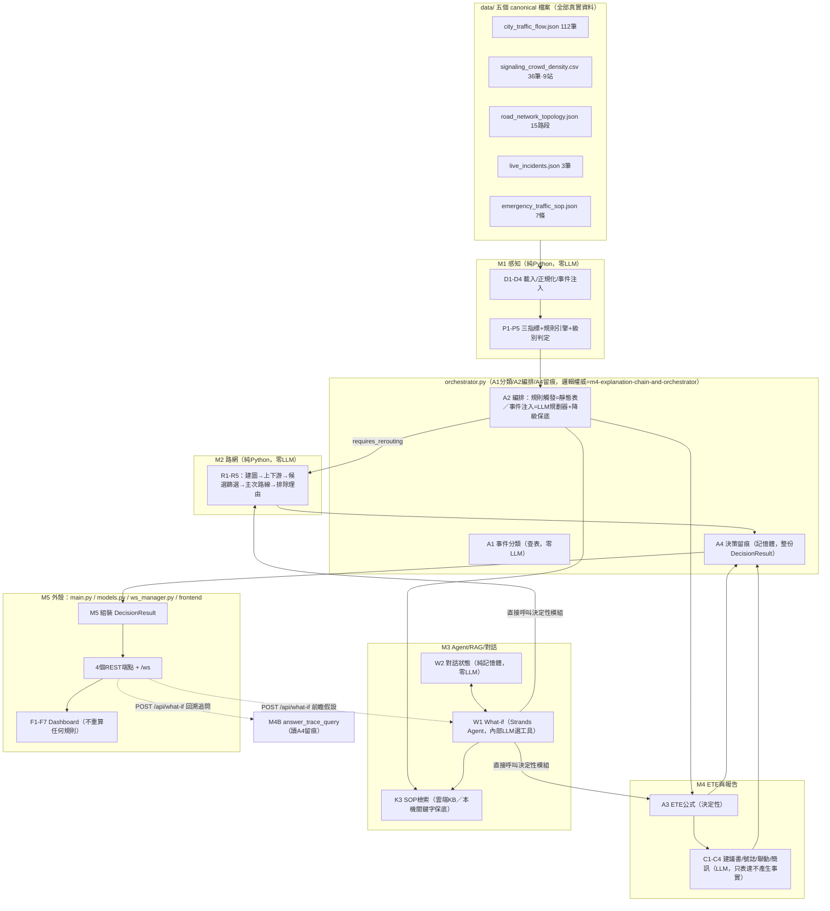

# 系統架構總覽（Master Architecture）

本檔是給 Kiro 的**第一份必讀文件**：先讀這份掌握全貌，再依 `INDEX.md`「🏗️建置順序」逐階段讀對應的 `.kiro/specs/*` 細節規格。本檔不重述細節規格已經寫清楚的內容（欄位定義、驗收測試逐條斷言），只負責把整個系統的形狀講清楚，讓後續讀個別 spec 時知道自己在架構的哪個位置。

與 `00-tech-stack.md`／`01-module-boundaries.md`／`02-data-contract.md`／`03-testing-and-ai-collaboration.md` 同為 always-load steering，具同等拘束力。本檔內容若與上述四份文件衝突，以那四份為準（本檔是總覽，不是新規則）；若與 `.kiro/specs/*` 衝突，本檔的「終版整合狀態」為準，因為它是在所有 spec 交叉核對完成後才寫的。

---

## 1. 一句話定位

「城市應變分析 AI Agent」是一個**半自動的交通事件應變決策支援系統**：感測資料 → 規則判定等級 → 路網重規劃 → LLM 生成建議書/簡訊 → 指揮官在單一 Dashboard 上看到並可對系統提問（What-if 模擬 / 回溯追問已做的決策）。**系統不自動執行任何交通管制動作**，只產出建議與說明；動手做決定的是人。

## 2. 鐵律：三層決策職責（貫穿全部模組，不可混）

```text
選工具  = LLM        A2（Strands Agent）決定呼叫哪些工具，不產生事實
算答案  = Python     A/B級、事件嚴重度、主/次路線、排除理由、ETE、恢復時間——全部決定性計算
寫文字  = LLM        建議書、簡訊、解釋敘述，只轉述上一層已經算好的事實，不得改寫任何數字/ID/條款編號
```

任何測試、任何新函式，先問自己屬於哪一層，再決定要不要對 LLM 輸出做精確斷言（見 `03-testing-and-ai-collaboration.md` §2）。

## 3. 模組地圖與所有權（最終版，含 `orchestrator.py` 雙 owner 澄清）

| 模組 | 契約代碼 | 擁有檔案 | 對外邊界 |
|---|---|---|---|
| M1 資料感知與規則 | `data_ingestion`／`sensing_rules` | `src/loaders.py`、`src/rules.py`、`data_manifest.md` | 只有 M1 能讀 `data/` 原始檔；其餘模組一律用 M1 產出的 `NormalizedDataBundle` |
| M2 事件與路網規劃 | `incident_routing` | `src/routing.py`、`data/display_geometry.json` | 只有 M2 能做路網演算（R1-R5）；其餘模組不得重算候選/上下游/排除理由 |
| M3 Agent、RAG、What-if、對話 | `bedrock_advisor` | `src/agent/`、`src/bedrock_service/`、`src/session/`（W2）、`prompts/*` | K3/W1/W2/F6 都在這裡；`bedrock_service/local_fallback.py`／`sop_data.py` 是決定性程式碼，`bedrock_kb.py` 才是真的呼叫雲端 |
| M4 ETE、建議書與通報 | `decision_reporting` | `src/reporting.py` | 只有 M4 能算 ETE；C1-C4 一律由 A2 編排觸發，不得被繞過直接呼叫 |
| **`orchestrator.py`（雙 owner，見下方說明）** | `api_orchestrator` | `src/orchestrator.py` | A1 分類、A2 編排、A4 留痕、對外路由的**核心邏輯權威**在 `m4-explanation-chain-and-orchestrator/`（SPEC-00/M4A/M4B/O1/O2/O3），不在 M5 |
| M5 API 外殼與 Dashboard | `api_orchestrator`／`dashboard` | `main.py`、`src/models.py`、`src/ws_manager.py`、`frontend/**` | `src/models.py` 是**全專案型別唯一定義處**；跟 `orchestrator.py` 內部邏輯有欄位命名衝突時，一律以 `models.py`／M5 spec 命名為準（`orchestrator.py` 只管流程順序，不發明欄位名） |

> **`orchestrator.py` 為什麼有兩個 spec 資料夾管**：這是團隊分工演變的結果，`01-module-boundaries.md` 已加註完整說明。生成 `orchestrator.py` 時，**內部邏輯**（A1 查表、A2 分派策略、七階段生命週期、A4 留痕、對外三分支路由）讀 `m4-explanation-chain-and-orchestrator/` 全部 6 份文件；**型別與命名**（`DecisionResult` 長什麼樣、`message_type` 叫什麼）讀 `m5-api-orchestrator-dashboard/`。兩邊對同一件事有分歧時，欄位命名以 M5 為準、編排邏輯以 M4 那組 spec 為準——這條分工線在本次審查中已經逐一核對過，衝突都已解決。

## 4. 端到端資料流程



## 5. API 表面與 WebSocket 訊息總表（本次審查最終收斂版）

固定 4 個 REST + 1 個 WS，不得擴充（`00-tech-stack.md` §4）：

| 端點 | 用途 | 回應 `message_type` | payload |
|---|---|---|---|
| `GET /api/dashboard` | 讀取現況 | `dashboard.updated.v1` | `DashboardPayload` |
| `POST /api/incidents/evaluate` | 評估一筆事件 | `decision.completed.v1` | `DecisionResult` |
| `POST /api/what-if` | 對話（見下方三分支） | `whatif.evaluated.v1` 或 `trace.answered.v1` | `WhatIfResult` 或 `TraceAnswer` |
| `GET /api/health` | 健康檢查 | 不使用 Envelope | `{status, use_bedrock, gateway_mode}` |
| `WS /ws` | 單向推播，F1-F7共用 | 見下表 | — |

`POST /api/what-if` 三分支路由（確定性、零LLM判斷走哪支，`SPEC-O3` §4）：

```text
1. 問題含前瞻假設詞（如果/假設/若/會怎樣/怎麼辦）→ W1模擬 → whatif.evaluated.v1／WhatIfResult
2. 否則 current_trace_id 非null → M4B回溯追問 → trace.answered.v1／TraceAnswer{trace_id, answer_text}
3. 否則 → 固定引導文字 → trace.answered.v1／TraceAnswer{trace_id:null, answer_text:固定文字}
```

WebSocket 推播事件（[2026-07-28總表整併時新發現並修正] 原本 `SPEC-O3` 與 `M5` 分別定義、有重複命名與遺漏，已統一）：

| `message_type` | 觸發時機 | payload | 前端接收者 |
|---|---|---|---|
| `rules.evaluated.v1` | `evaluate_rules` 回傳後 | `SensingResult` | F1 |
| `decision.alert.v1` | P5 判定 B→A 或 normal→B 轉換 | `{level, description, ete_minutes}` | F2（自動彈窗） |
| `decision.cycle_start.v1` | 決策週期 OPEN | `{trace_id, triggered_by}` | Agent活動面板 |
| `decision.task_update.v1` | 每次 DISPATCH／完成／逾時 | `{trace_id, dispatch_seq, status}` | Agent活動面板 |
| `decision.completed.v1` | `DecisionResult` 組裝並留痕後 | `DecisionResult` | F4／F5／F7 |
| `dashboard.updated.v1` | 決策完成或現況變動 | `DashboardPayload` | F1 |
| `whatif.evaluated.v1` | What-if模擬完成 | `WhatIfResult` | F6 |
| `trace.answered.v1` | 回溯追問／無週期完成 | `TraceAnswer` | F6 |
| `chat.*.v1`（`loading_start`／`loading_step`／`response`／`input_lock`／`system_status`／`session_cleared`／`clear_session`） | F6 對話面板專用，`chat.response.v1` 為雙通道冗餘推播、`chat.clear_session.v1` 是唯一走WS而非REST的例外 | 見 `F6-chat-ui/design.md` | F6 |

所有推播與對應 REST 回應共用同一個 `correlation_id`；`decision.alert.v1`／`decision.cycle_start.v1`／`decision.task_update.v1` 由 `orchestrator.py` 呼叫 `ws_manager.broadcast()`，`ws_manager.py` 本身不判斷觸發時機。

## 6. `DecisionResult`（最終型別，欄位名以 `models.py` 為準）

```text
DecisionResult {
  trace_id, triggered_by[], level("A"|"B"|null)
  incident: {event_id, location, ...} | null
  routes: { primary, secondary, excluded[], findings[], candidates[] } | null
  ete: {minutes, recovery_at, formula} | null
  control_center_report: string | null   // C1+C2+C3 全文合一，不拆結構化欄位
  notifications: {zh, en?, ja?, ko?} | null  // C4
  degraded: string[]     // 如 ["C1_FAILED","P5_TIMEOUT"]
  duration_ms: int
  is_simulated: bool     // 依實際引用資料的provenance動態算，不是寫死true
}
```

## 7. 決策週期七階段（`SPEC-O1`）

```text
OPEN → FLAGS(SOP-6多語旗標) → PLAN(靜態表或LLM規劃器) → EXECUTE(平行/序列任務)
→ SUMMARY → EXPLAIN(M4B生成說明) → PUSH(REST回傳+WS推播)
```

同一時間僅一個週期執行（FIFO排隊）；**What-if 不是週期**，不寫 trace、可與進行中週期並行。

## 8. 三筆黃金事件（已對照真實資料與SOP原文驗證，逐字吻合）

| 事件 | 主因SOP | 主/次路線 | ETE | 驗證依據 |
|---|---|---|---:|---|
| `TPE_2026_ACC_001` 路面塌陷22:10 | SOP-2（並1、6、7） | `RD_TPE_004`／`RD_TPE_005` | **90分**→23:40 | `RD_TPE_002` sat=1.0（真實資料） |
| `TPE_2026_EVT_002` 人群推擠22:20 | SOP-3（並4、6、7） | — | **70分** | `RD_TPE_001` sat=1.0，`BL17 User_Count=31000>25000`觸發（非growth） |
| `TPE_2026_EVT_003` 號誌故障22:30 | SOP-5（並7） | — | **41分** | `RD_TPE_007` sat=0.85→B級 |

SOP-6 多語觸發：`BS_TPE_101=0.40`、`BS_XY_ATT=0.30`；`BS_TPE_DOME`≈0.05 不觸發。

## 9. 保底模式（硬性要求，`00-tech-stack.md` §6）

`USE_BEDROCK=false` 時：SOP檢索退化本機關鍵字比對（`retrieval_source=local_fallback`）、建議書退化固定模板、Agent工具選擇退化查表——三個決定性工具（規則/路網/ETE）本來就是純Python不受影響。任何下游模組失敗都不得讓整個回應變成 `error`，只要還有可呈現的事實就回 `partial`。

## 10. 加分項（P1，核心完成後才做）

- `AgentCore Runtime` 部署 `agent.py`（`architecture-reference/加分項_AgentCore_Runtime部署.md`）——範圍僅此一項，不含 Memory/Gateway/Cognito 等其他 AgentCore 子服務；主流程不依賴它。

## 11. 文件地圖

需要實作細節時依此順序查：架構問題先查本檔 → 技術棧/目錄結構查 `00-tech-stack.md` → 模組所有權查 `01-module-boundaries.md` → 資料/公式/黃金值查 `02-data-contract.md` → 測試要求查 `03-testing-and-ai-collaboration.md` → 個別模組實作細節查 `.kiro/specs/<模組>/` → 全部已知問題與修正歷史查 `INDEX.md`。
