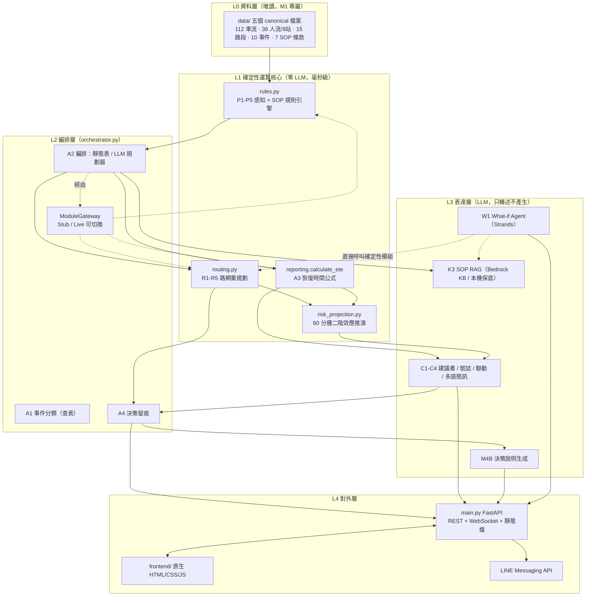

# 城市應變分析 AI Agent（CityNexus / Urban Sentinel AI）系統架構書

> 版本：2026-08-02 ｜ 對應分支：`victor/orch` ｜ 撰寫依據：**實際程式碼**（非設計文件推測）
> 驗證狀態：`pytest tests/ -q` → **384 passed**（`USE_BEDROCK=false`，2026-08-02 實跑）

---

## 目錄

1. [這份文件怎麼讀](#1-這份文件怎麼讀)
2. [系統定位：這套系統在解什麼問題](#2-系統定位這套系統在解什麼問題)
3. [三條設計鐵律](#3-三條設計鐵律)
4. [全景架構](#4-全景架構)
5. [技術棧與執行形態](#5-技術棧與執行形態)
6. [資料層：五個 canonical 檔案 → NormalizedDataBundle](#6-資料層五個-canonical-檔案--normalizeddatabundle)
7. [模組地圖與邊界機制（ModuleGateway）](#7-模組地圖與邊界機制modulegateway)
8. [確定性運算核心（零 LLM）](#8-確定性運算核心零-llm)
9. [LLM 層：五個 LLM 落點與各自的護欄](#9-llm-層五個-llm-落點與各自的護欄)
10. [決策週期七階段（實際時序）](#10-決策週期七階段實際時序)
11. [動態行為：模擬時鐘與持續監測](#11-動態行為模擬時鐘與持續監測)
12. [決策留痕與解釋鏈](#12-決策留痕與解釋鏈)
13. [對話子系統（W1 / W2 / K3 / F6）](#13-對話子系統w1--w2--k3--f6)
14. [API 表面](#14-api-表面)
15. [WebSocket 訊息總表](#15-websocket-訊息總表)
16. [前端架構](#16-前端架構)
17. [對外整合：LINE Messaging API](#17-對外整合line-messaging-api)
18. [設定、環境變數與執行模式矩陣](#18-設定環境變數與執行模式矩陣)
19. [失敗與降級矩陣](#19-失敗與降級矩陣)
20. [測試策略](#20-測試策略)
21. [部署](#21-部署)
22. [這套系統是怎麼被 build 出來的](#22-這套系統是怎麼被-build-出來的)
23. [已知落差與技術債](#23-已知落差與技術債)
24. [附錄](#24-附錄)

---

## 1. 這份文件怎麼讀

| 你是誰 | 建議讀法 |
|---|---|
| 第一次接觸這套系統 | §2 → §3 → §4 → §10，二十分鐘掌握全貌 |
| 要改規則／路網／ETE | §6 → §8，這三章是系統的「事實來源」 |
| 要改 LLM 相關行為 | §3 → §9 → §13 |
| 要接前端／串接 API | §14 → §15 → §16 |
| 要部署或做 Demo | §5 → §18 → §19 → §21 |
| 要接手維護 | 全部，特別是 §23 |

本文件描述的是**倉庫裡實際跑得起來的東西**。設計階段的規格書在 `.kiro/specs/`、
設計原則在 `.kiro/steering/`，兩者與本文件出現差異時，本文件記錄的是「現況」，
`.kiro/steering/` 記錄的是「約束」——差異本身是有意義的資訊，已集中在 §23。

---

## 2. 系統定位：這套系統在解什麼問題

### 2.1 一句話

**半自動的交通事件應變決策支援系統**：感測資料 → 規則判定等級 → 路網重規劃 →
LLM 生成建議書／通報簡訊 → 指揮官在單一 Dashboard 上看到、並可對系統提問。

### 2.2 邊界（很重要）

**系統不自動執行任何交通管制動作。** 它只產出「建議」與「說明」；按下按鈕的是人。

這條邊界決定了整套架構的形狀：

- 因為不執行，所以**可解釋性 > 自動化程度**。每個結論都必須攤開依據。
- 因為指揮官要為決策負責，所以系統**不能有任何無法追溯的數字**。
- 因為現場是高壓環境，所以**永不沉默**：任何模組失敗都要說出來，不能安靜降級。

### 2.3 使用情境（黃金腳本）

```
17:00 ──────────────────────── 23:30   （資料集時間軸，模擬器一秒推進一分鐘）
              │      │     │
           22:10   22:20  22:30
        路面塌陷  人群推擠 號誌故障
```

指揮官在 Dashboard 上：

1. 看到 KPI（活躍事件數／最高應變等級／全網平均飽和度／多語通報站點數）
2. 注入一起事件 → 0.3 秒內地圖上出現改道路線、ETE、風險時間軸
3. 約 20 秒後交控建議書（LLM 生成）補上
4. 路況繼續惡化 → 系統自動偵測推薦路線失效 → 重規劃 → 重寫建議書
5. 指揮官在對話框追問「為什麼不走比較空的仁愛路？」→ W1 Agent 引用同一份事實回答
6. 按「發送至 LINE」把多語通報推播出去

---

## 3. 三條設計鐵律

### 鐵律一：三層決策職責，不可混

```text
選工具  = LLM        Agent 決定呼叫哪些工具，不產生事實
算答案  = Python     A/B 級、嚴重度、主/次路線、排除理由、ETE、恢復時間 —— 全部決定性計算
寫文字  = LLM        建議書、簡訊、解釋敘述，只轉述上一層已算好的事實
```

LLM **永遠不能**捏造或修改：事件 ID、位置、級別、路線代號、飽和度、ETE、SOP 條款編號。

落實機制是 `reporting.build_facts_block()`——一個把所有確定性事實組成文字塊的函式。
交控建議書、What-if 對話、情境建議書三處**共用同一個函式**，所以三處的數字必然一致。
要加欄位就加在那裡；再寫一份「類似的」就是在製造第二個真相來源。

### 鐵律二：永不沉默

任何降級都必須是**可見的**：

- `DecisionResult.degraded: list[str]`（如 `["C1_FAILED", "ROUTING_FAILED"]`）隨回應送到前端
- `SopQueryResult.retrieval_source`（`bedrock` / `local` / `local_fallback`）標示 RAG 走了哪條路
- `src/bedrock_status.py` 在啟動時**真的呼叫一次 Bedrock**（`max_tokens=1`）確認通不通，
  並把結果印成終端機橫幅 + 推到 Dashboard KPI + `/api/health`
  ——因為 `USE_BEDROCK=true` 只表示「允許呼叫」，不表示「呼叫得通」

### 鐵律三：保底模式必須全流程可跑

`USE_BEDROCK=false` 時：

| 元件 | 保底行為 |
|---|---|
| K3 SOP 檢索 | 退化為本機關鍵字比對（`local_fallback.py`），`retrieval_source="local"` |
| A2 規劃器 | 退化為靜態分派表（`_CLAUSE_CHAIN`） |
| C1-C4 建議書／簡訊 | 退化為固定模板（`_generate_c1_c3_fallback` / `_generate_c4_fallback`） |
| M4B 決策說明 | 退化為原始紀錄逐條列出 |
| W1 對話 | 退化為只回本機 SOP 檢索結果 |
| **規則／路網／ETE／風險推演** | **完全不受影響**——本來就是純 Python，黃金值照樣正確 |

---

## 4. 全景架構

### 4.1 分層視角



### 4.2 執行形態（單一行程）

```
┌───────────────────────────────────────────────────────────────┐
│  uvicorn main:app  （單一 Python 行程）                        │
│                                                               │
│  ┌─────────────┐  ┌──────────────┐  ┌──────────────────────┐ │
│  │ Event Loop  │  │ 背景任務 ×2  │  │ ThreadPool           │ │
│  │ REST/WS     │  │ ・規則監測    │  │ (asyncio.to_thread)  │ │
│  │ 處理        │  │  每 10 秒     │  │ ・全部確定性運算      │ │
│  │             │  │ ・模擬器 tick │  │ ・全部 Bedrock 呼叫   │ │
│  │             │  │  每 1 秒      │  │ ・全部檔案 I/O        │ │
│  └─────────────┘  └──────────────┘  └──────────────────────┘ │
│                                                               │
│  狀態：全部在行程記憶體（GlobalState / _TRACES / SESSION_STORE）│
│  無資料庫、無 Redis、無外部佇列                                 │
└───────────────────────────────────────────────────────────────┘
```

**關鍵設計：event loop 上不做任何阻塞工作。**
`handle_incident()` 裡連 50ms 的 `evaluate_rules()` 都包進 `asyncio.to_thread`——
不是因為它慢，而是為了讓「這個函式裡沒有任何同步阻塞」成為一眼可檢查的性質，
而不是每加一個步驟就要重新判斷「這個夠不夠快」。

工作執行緒要推 WebSocket 訊息時，經由 `src/async_bridge.py`
（`asyncio.run_coroutine_threadsafe` + startup 登記的 loop 參照），
不能用 `asyncio.ensure_future`——工作執行緒根本沒有 loop。

---

## 5. 技術棧與執行形態

### 5.1 依賴（`pyproject.toml`，Python ≥ 3.12）

| 套件 | 用途 | 備註 |
|---|---|---|
| `fastapi` + `uvicorn[standard]` | REST + WebSocket + 靜態檔 | 單一 Server，不分前後端部署 |
| `pydantic>=2` | 全專案型別定義（`src/models.py`） | 唯一型別來源 |
| `boto3` | Bedrock Converse API、Knowledge Base Retrieve、S3、EC2/IAM | |
| `strands-agents` | W1 What-if Agent、A2 規劃器的 tool-calling 框架 | |
| `bedrock-agentcore` | AgentCore Runtime entrypoint（加分項） | 主流程不依賴 |
| `networkx` | steering 文件指定用於路網演算 | **實際未被 import**，見 §23 |
| `pytest` + `hypothesis`（dev） | 測試 | |

### 5.2 前端：零建置

`frontend/` 是**原生 HTML / CSS / JavaScript**，沒有 npm、沒有打包、沒有 transpile。
唯一的第三方是 `frontend/vendor/chart.umd.js`（Chart.js，直接放檔）。
地圖是手寫 SVG（`map.js` / `geomap.js`），不依賴任何地圖服務。

代價是 `app.js` 有 3,222 行；好處是 `git clone` 後不需要任何前端工具鏈就能跑。

### 5.3 規模

| | 行數 |
|---|---:|
| `src/**/*.py` | 11,366 |
| `main.py` | 2,011 |
| `frontend/js/**` | 6,382 |
| `frontend/css/**` | 6,795 |
| `tests/**`（384 個測試） | — |

---

## 6. 資料層：五個 canonical 檔案 → NormalizedDataBundle

### 6.1 原始檔案

| 檔案 | 內容 | 筆數 | 時間範圍 |
|---|---|---:|---|
| `data/city_traffic_flow.json` | 車流：路段 × 時刻的速率／車輛數／飽和度／車道狀態 | 112 | 17:00–23:15 |
| `data/signaling_crowd_density.csv` | 人流：基站 × 時刻的人數／停留時間／成長率／漫遊比率 | 36（9 站） | 17:00–23:30 |
| `data/road_network_topology.json` | 路網拓樸：15 路段的流向／交叉路口／容量／替代路線／鄰近基站 | 15 | 靜態 |
| `data/live_incidents.json` | 可注入事件庫 | 10 | 22:00–22:50 |
| `data/emergency_traffic_sop.json` | 交通應變 SOP 全文 | 7 條款 | 靜態 |
| `data/display_geometry.json` | 前端 SVG 地圖的座標（viewBox + display_points） | — | 靜態 |

> `data/sop-index/` 是 `scripts/generate_sop_index_files.py` 產出的 Bedrock Knowledge Base
> 索引檔（每條款一個檔），供 S3 上傳建 KB 用。

### 6.2 D1-D4 載入與正規化（`src/loaders.py`）

```
D1 讀檔 ──► D2 欄位正規化 ──► D3 provenance 標記 ──► D4 事件注入
```

正規化處理的實際差異：

- 時間戳 `"2026-05-20 22:10"` → 帶 `+08:00` 時區的 `datetime`（全系統禁止 naive datetime）
- CSV 的 `Roaming_User_Pct` 是 `"8%"` 字串 → `0.08` 浮點數
- 大寫欄位名（`Segment_ID`、`Saturation_Score`）→ snake_case
- 每筆樣本標上 `provenance`（`PROVIDED` / `DEMO` / `DERIVED`），
  `DecisionResult.is_simulated` 是依此**動態算出來**的，不是寫死 true

`on_incident_injected()` 負責 D4：把新事件併進 bundle 的 incidents。

### 6.3 唯一資料入口

`NormalizedDataBundle`（Pydantic）是**其他所有模組唯一能拿到的資料形狀**。
`01-module-boundaries.md` 的規則：只有 M1 能讀 `data/` 原始檔。

### 6.4 as-of 查詢語意（貫穿全系統）

所有資料查詢都是 **as-of**：取 `timestamp <= as_of` 中最新的一筆。

```python
def _as_of_traffic(bundle, segment_id, as_of):
    candidates = [t for t in bundle.traffic
                  if t.segment_id == segment_id and t.timestamp <= as_of]
    return max(candidates, key=lambda t: t.timestamp) if candidates else None
```

**查無資料回傳 `None`，不是 `0`。** 這個區分很重要：
`0` 是「這條路很順」，`None` 是「我不知道這條路的狀況」——後者在路網規劃裡
會被排除（`MISSING_TRAFFIC_SNAPSHOT`），前者會被選成主線。

`as_of` 從哪來，優先序是：明確傳入的參數 > `incident.timestamp` >
`clock.simulation_time()` > 資料集最晚時間戳。

### 6.5 系統時鐘（`src/clock.py`）

系統裡同時存在兩種時間：

- **模擬器時間**：使用者在畫面上看到、也是所有資料被評估的那一刻（17:00→23:30）
- **真實時間**：這台機器的牆上時鐘

`clock.now()` 是全系統「現在幾點」的單一來源——模擬器在跑就回模擬器時刻，
否則回真實時間，一律帶 `+08:00`。

刻意保持真實時間的三處（它們描述的是行程本身而非被模擬的世界）：
`loaders.loaded_at`、`bedrock_status.last_ok_at`、前端 Header 的在線指示時鐘。

---

## 7. 模組地圖與邊界機制（ModuleGateway）

### 7.1 模組所有權

| 模組 | 契約代碼 | 擁有檔案 | 獨佔能力 |
|---|---|---|---|
| M1 資料感知與規則 | `data_ingestion` / `sensing_rules` | `src/loaders.py`、`src/rules.py` | 唯一能讀 `data/` 原始檔 |
| M2 事件與路網規劃 | `incident_routing` | `src/routing.py` | 唯一能做路網演算（R1-R5） |
| M3 Agent / RAG / 對話 | `bedrock_advisor` | `src/agent/`、`src/bedrock_service/`、`src/session/`、`prompts/` | K3 / W1 / W2 / F6 |
| M4 ETE 與報告 | `decision_reporting` | `src/reporting.py` | 唯一能算 ETE |
| Orchestrator（雙 owner） | `api_orchestrator` | `src/orchestrator.py` | A1 分類、A2 編排、A4 留痕 |
| M5 API 外殼與 Dashboard | `api_orchestrator` / `dashboard` | `main.py`、`src/models.py`、`src/ws_manager.py`、`frontend/` | `models.py` 是全專案型別唯一定義處 |

**`orchestrator.py` 的雙 owner 分工線**（這是團隊分工演變的結果，不是設計缺陷）：
內部邏輯（A1 查表、A2 分派策略、七階段生命週期、A4 留痕）以
`.kiro/specs/m4-explanation-chain-and-orchestrator/` 為權威；
型別與欄位命名以 `.kiro/specs/m5-api-orchestrator-dashboard/` 為權威。

### 7.2 ModuleGateway：跨模組唯一通道

跨模組存取**一律經由** `orchestrator.GATEWAY`，不直接 import 其他模組的函式。

```python
class ModuleGateway(Protocol):
    def load_data(self) -> NormalizedDataBundle: ...
    def evaluate_rules(self, bundle, incident=None, as_of=None) -> SensingResult: ...
    def plan_routes(self, request: RouteRequest) -> RoutePlan: ...
    def calculate_ete(self, incident, bundle) -> EteEstimate: ...
    def count_intersections(self, incident, bundle) -> int: ...
    def generate_report(self, incident, sensing, route_plan, ete,
                        advisory, bundle, merged_incident_info=None) -> tuple[str, Notification | None]: ...
    def run_agent(self, incident, sensing, route_plan, ete) -> BedrockAdvisory: ...
```

兩種實作：

| | 用途 | 行為 |
|---|---|---|
| `StubGateway` | 開發初期 / `USE_STUB_MODULES=true` | 回傳 ACC_001 黃金值反推的固定假資料 |
| `LiveGateway` | 正常運作 | 轉呼真實模組，各方法內含 try/except 降級到 Stub |

`build_gateway()` 依 `USE_STUB_MODULES` 決定實例，由 `main.py` 在 import 時
**直接賦值給 `orchestrator.GATEWAY`**（不是 main 的區域變數——那是曾經踩過的坑：
`orchestrator.py` 內部的函式永遠只會看到自己模組層級的那個 `GATEWAY`）。

### 7.3 為什麼 W1 不經過 orchestrator 的函式

`agent/tools.py::simulate_scenario` 呼叫的是 `whatif_engine.run_scenario()`，
而不是 `orchestrator.handle_incident()`——避免 `Orchestrator → W1 → Orchestrator`
的循環依賴。但它**仍然經由 `orchestrator.GATEWAY`** 存取確定性模組，
所以算出來的東西跟決策週期用的是同一套程式碼。

---

## 8. 確定性運算核心（零 LLM）

這一章是整套系統的事實來源。這裡算出來的每個數字都可以逐項復現，
LLM 只能引用不能改寫。

### 8.1 P1-P5：感知計算與 SOP 規則引擎（`src/rules.py`）

#### P1-P3：三個指標查詢（全部 as-of）

| 函式 | 回傳 | 用於 |
|---|---|---|
| `get_saturation(bundle, segment_id, as_of)` | 路段飽和度 0.0–1.0 | SOP-1 分級、路線篩選、ETE |
| `get_growth_rate(bundle, station_id, as_of)` | 人流成長率（小數） | SOP-3 / SOP-4 |
| `get_roaming_ratio(bundle, station_id, as_of)` | 漫遊比率 0.0–1.0 | SOP-6 多語判定 |

#### P4：規則引擎 `evaluate_rules()` — 七條 SOP 的實際判定條件

| 條款 | 觸發條件（程式碼實況） | 需要 incident | 產出 |
|---|---|:---:|---|
| **SOP-1** 壅塞分級 | 掃全 15 路段，`saturation >= 0.85` | 否 | 每條命中路段一筆 `RuleHit`；`RD_TPE_001`/`RD_TPE_002` 額外標 `city_response=True` |
| **SOP-2** 車禍路障 | `status ∈ {Closed, Blocked, Restricted}` **且** `severity ∈ {High, Critical}` **且** `affected_segment` 以 `RD_` 開頭 | 是 | `is_primary=True` |
| **SOP-3** 捷運分流 | `BS_MRT_BL17` 的 `growth_rate > 0.30` **或** `user_count > 25000` | 否 | — |
| **SOP-4** 大型活動散場 | `BS_TPE_DOME` 歷史峰值 `>= 30000` **且** 當下 `growth_rate <= -0.20` | 否 | 觸發時**自動連動追加 SOP-3** |
| **SOP-5** 號誌故障 | `incident.type == "Power_Failure"` | 是 | 下游算警力 = 路口數 × 2 |
| **SOP-6** 多語通報 | **任一**基站 `roaming_user_pct >= 0.30` | 否 | 設 `multilingual_required=True` |
| **SOP-7** ETE | 只要有 incident 就標記 | 是 | 通知下游要算 ETE（本身不是判定規則，是公式定義） |

> SOP-4 的「歷史峰值」只計入 `timestamp <= as_of` 的記錄——否則模擬器跑到 20:00
> 就會用 22:00 的峰值判定，等於偷看未來。

#### P5：等級判定 `determine_level()`

```
saturation >= 0.95           → A 級（癱瘓 / 紅燈）
0.85 <= saturation < 0.95    → B 級（壅擠 / 黃燈）
其他                          → normal
```

兩個變體，用途不同（曾經混用造成畫面數字對不上）：

- `determine_level(rule_hits)`：取**全市最高**等級 → Dashboard KPI
- `determine_level_for_segment(bundle, segment_id, as_of)`：只看**該事件影響路段** → `DecisionResult.level`

#### 判定依據的人話化

`describe_evidence()` 把 `EvidenceRef{field, value, threshold}` 轉成指揮官讀得懂的句子。
措辭寫在 `rules.py` 而不是前端——判定邏輯改了，措辭要跟著改，兩者放同一個檔才不會漂移。

（否則畫面上會出現這種東西：`SOP-2 光復南路 status+severity Closed/Critical 門檻 Closed|Blocked|Restricted + High|Critical`）

### 8.2 R1-R5：路網重規劃（`src/routing.py::plan_route`）

輸入 `RouteRequest{incident, bundle, as_of, extra_closed_segments}`，輸出 `RoutePlan`。
純確定性，60 秒 SLA（實測毫秒級）。

#### 完整篩選流程

```
R1 建索引：segment_map = {segment_id: RoadSegment}
   └─ 找不到事故路段 → no_feasible_route=True 直接返回

R2 決定不可用路段集合 closed_segments
   = {affected_segment} ∪ {affected_road} ∪ extra_closed_segments
     （extra_closed_segments 來自：疊加的第二起事件、或使用者的 What-if 假設）

R3 逐一評估 affected_seg.alternatives，七道檢查：
   1. ID 存在於路網               否 → UNKNOWN_SEGMENT
   2. 不在 closed_segments         否 → CLOSED
   3. capacity_vph >= 1000         否 → CAPACITY_INSUFFICIENT
   4. 與事故路段直接相鄰            否 → NOT_DIRECTLY_INTERSECTING   ★ 見下方「自適應篩選」
   5. 上下游判定（依 flow_direction）→ upstream / downstream / parallel
   6. 有飽和度快照                  否 → MISSING_TRAFFIC_SNAPSHOT
   7. saturation < 0.85            否 → SATURATED（暫存，R4 可能救回）

R4 主次排序：
   排序鍵 = (飽和度 ↑, 容量 ↓, segment_id ↑)
   upstream + parallel 優先於 downstream（SOP-2 §2a(3) 上游優先）
   primary   = 上游候選第一名
   secondary = 剩餘上游 + 下游 的第一名

R5 排除理由：每個被排除的候選都帶 reason_code 進 RoutePlan.excluded
```

#### 兩個關鍵的例外處理（都是實測踩出來的）

**① 自適應的「直接相鄰」篩選**

SOP-2 §2a(2) 要求替代路線必須出現在事故路段的 `intersections` 裡。
但實測發現 15 條路段中有 **10 條**的 alternatives 全部通不過這道篩選
（路網資料裡 `intersections` 記的是「交叉路口名稱」，`alternatives` 記的是「路段代號」，
兩者本來就不是同一組東西）。

- 整個移除篩選 → `ACC_001` 的黃金值壞掉（敦化南路一段 0.72 會贏過市民大道四段 0.78 變成主線）
- 保留篩選 → 那 10 條路段一出事就直接回「無可行替代路線」

**現行做法：優先套用篩選，篩不出東西時才放寬**，並記一筆
`INTERSECTION_FILTER_RELAXED` finding 讓指揮官知道這些路線不是直接相鄰的。

**② 候選全數飽和時仍指派（SOP-2 §2a 明文例外）**

SOP 原文：「若主替代路段已飽和（≥0.85），**仍指派該路線**並啟動長綠燈時制，
說明可能仍飽和並建議搭乘大眾運輸。」

所以沒有任何未飽和候選時，取飽和度最低的兩條救回成主／次線，並且：

- `all_alternatives_saturated = True`（獨立旗標——`no_feasible_route` 表達不出這件事）
- 記一筆 `SATURATED_BUT_RETAINED` finding，列出全部被保留的路段與飽和度
- 建議書必須明確寫「這是權宜路線，本身仍處飽和」

> 指揮官需要的是「最不糟的那條路 + 配套措施」，不是「沒有辦法」。
> 事故現場的車流不會因為系統說沒路就消失。

#### 路線有效性檢查 `check_route_validity()`

供背景監測用（純確定性，可以每 10 秒跑）：

```
主/次線有效 ⟺ 飽和度 < 0.85 且 不在 closed_segments
任一失效 → needs_replan=True，invalid_reasons={segment_id: "SATURATED_0.92" | "CLOSED_BY_NEW_INCIDENT"}
```

### 8.3 A3：ETE 恢復時間公式（`src/reporting.py::calculate_ete`）

**唯一公式來源。** 任何地方要顯示 ETE 都必須呼叫這個函式。

```python
base = {"Critical": 60, "High": 40, "Medium": 20, "Low": 20}[severity]
avg_sat = 受影響路段在 incident.timestamp 的 as-of 飽和度（多條取平均；查無資料時用 0.5）
congestion_penalty = max(0, (avg_sat - 0.5) * 60)
minutes = int(base + congestion_penalty)
recovery_at = incident.timestamp + minutes
formula = f"{base} + max(0,({avg_sat}-0.5)*60) = {minutes}"    # 字串一併回傳，供追溯
```

#### 三筆黃金驗收值（測試逐值鎖定）

| 事件 | 類型 | severity | base | 路段飽和度 | 計算 | **ETE** |
|---|---|---|---:|---:|---|---:|
| `TPE_2026_ACC_001` 路面塌陷 22:10 | Road_Collapse | Critical | 60 | `RD_TPE_002` = 1.00 | 60 + (1.00−0.5)×60 = 60+30 | **90 分** → 23:40 |
| `TPE_2026_EVT_002` 人群推擠 22:20 | Crowd_Surge | High | 40 | `RD_TPE_001` = 1.00 | 40 + 30 | **70 分** |
| `TPE_2026_EVT_003` 號誌故障 22:30 | Power_Failure | Medium | 20 | `RD_TPE_007` = 0.85 | 20 + (0.85−0.5)×60 = 20+21 | **41 分** |

#### 同路段多事件合併 ETE

同一路段同時有多起活躍事件時（`orchestrator.calculate_merged_ete`）：

```
合併 ETE = max(各事件 ETE) + (事件數 − 1) × 15 分鐘
```

15 分鐘是每多一起事件的現場協調延遲。合併資訊寫進
`DecisionResult.merged_incident_info`，建議書會據此說明。

### 8.4 二階效應推演（`src/risk_projection.py`）

回答一個決策支援系統該回答、但多數系統不回答的問題：
**「照這個建議做下去，接下來 60 分鐘會出什麼新問題？」**

#### 模型

```
封閉路段釋出的車流量 = 該路段 vehicle_count
實際落到指定替代路線的比例 = TRANSFER_CAPTURE_RATE = 0.62
   （其餘：走了沒推薦的小路、改搭大眾運輸、延後或取消行程）
主線承擔比例 = PRIMARY_ROUTE_SHARE = 0.60，次線 0.40
車流轉移完成需要 = TRANSFER_RAMP_MINUTES = 30 分鐘（線性爬升）
推演範圍 = 60 分鐘，解析度 = 5 分鐘
```

**主次分配刻意不用「剩餘容量比例」**：第一版那樣寫，對 ACC_001 算出主線只承接 7%
（因為市民大道四段幾乎沒餘裕、仁愛路四段很空）。但現實不是那樣運作——
CMS 上寫著「請改道市民大道四段」，車就往那裡去。**系統指定哪條，哪條就承受主要壓力**，
這正是「推薦路線自己會不會爆」值得被回答的原因。

#### 校準依據（誠實揭露）

三個參數是對照 ACC_001 資料集的實際觀測值校準的：

```
RD_TPE_004 市民大道四段  2300 → 2500(22:15) → 2800(22:30) → 2900(22:45)
RD_TPE_005 仁愛路四段    1500 → 1700(22:15) → 1800(22:30) → 1900(22:45)

封閉路段釋出 1600 輛，兩條路 35 分鐘內共吸收約 1000 輛（約六成），主次比約 60:40。
模型推出 RD_TPE_004 於 22:19 達 B、22:31 達 A；實際觀測 22:15 與 22:30。
```

這是**單一事件的校準，不是統計上站得住腳的參數估計**。
每份推演都會把 `assumptions` 列出來，就是為了讓看的人知道哪些數字可以質疑。

#### 產出

每個 `ProjectedRisk` 包含：發生時刻（絕對 HH:MM）、路段、將達級別、
推估飽和度 vs 現在飽和度、人話因果、觸發的 SOP 條款、**對策**（取自 SOP 條文，不由 LLM 發明）。

主次線都會在推演期內達 A 級時，`no_safe_route=True` + `escalation` 升級建議——
那代表單靠改道解決不了，指揮官要立刻知道。

---

## 9. LLM 層：五個 LLM 落點與各自的護欄

系統裡總共有五處呼叫 LLM。每一處的權責與護欄都不同：

| # | 落點 | 檔案 | 模型 | 逾時 | 失敗時 |
|---|---|---|---|---:|---|
| ① | **A2 工具規劃器** | `agent/a2_orchestrator_agent.py` | Sonnet 4.5 | 8s | 靜態分派表 |
| ② | **C1-C3 交控建議書** | `reporting.py::_generate_with_llm` | Haiku 4.5 | 30s | 固定模板 |
| ③ | **C4 多語通報** | `reporting.py::_generate_notification_with_llm` | Haiku 4.5 | 30s | 固定模板 |
| ④ | **M4B 決策說明** | `decision_trace.py::_invoke_m4b_llm` | Sonnet 4.5 | 30s | 原始紀錄逐條列出 |
| ⑤ | **W1 What-if Agent** | `agent/whatif_agent.py` | Sonnet 4.5（Strands） | 60s | 只回本機 SOP |

模型設定集中在 `src/llm.py`：

```python
DEFAULT_BEDROCK_MODEL_ID = "global.anthropic.claude-sonnet-4-5-20250929-v1:0"
DEFAULT_REPORT_MODEL_ID  = "us.anthropic.claude-haiku-4-5-20251001-v1:0"   # 建議書：量大、要快
```

`run_with_timeout()` 是共用的逾時包裝；`get_strands_model()` 快取模型物件
（避免每次請求都開新的 boto3 client）。

### 9.1 ① A2 工具規劃器：LLM 只選工具

**規劃器「只規劃、不執行」**——它回傳的是工具序列（`ToolPlan`），不是計算結果。
實際執行由 `orchestrator.handle_incident()` 統一做，所以不會出現
「規劃器算一次、orchestrator 再算一次」的重複計算。

三層護欄（任一層失敗 → `degraded=True` → 改走靜態鏈）：

```
護欄① 白名單    ：產出的工具名必須全在 ToolName enum 內
護欄② 必要步驟  ：check_required_steps()——§2 事件的計畫必須含 CALC_ETE 等
護欄③ 逾時      ：PLANNER_TIMEOUT_S = 8.0
```

靜態分派表（`_CLAUSE_CHAIN`）本身零 LLM：

| 條款 | 工具鏈 |
|---|---|
| §1 / §1-A / §1-B 壅塞分級 | `CALC_ETE` |
| §2 車禍路障 | `GRAPH_BUILD → UPSTREAM_JUDGE → CANDIDATE_FILTER → ROUTE_SELECT → CALC_ETE` |
| §3 大眾運輸分流 | `CALC_ETE` |
| §4 大型活動散場 | `CALC_ETE`（**自動連動 §3**，確定性展開，不交 LLM） |
| §5 停電／號誌失效 | `COUNT_INTERSECTIONS → CALC_ETE` |
| §6 多語 | 不分派任務，只設 flag |

每條鏈固定前置 `RAG_SEARCH`、固定收尾 `FORMAT_REPORT`；`multilingual=True` 時追加 `TRANSLATE`。
同批次多條規則映射到同一工具時保序去重（§2.2 同主責合併）。

**還有第四道安全網**：即使規劃器與靜態鏈都漏了必要工具，
`handle_incident()` 裡有補位邏輯——`requires_rerouting` 但 `route_plan is None` 時
直接補呼叫一次，確保 `DecisionResult` 欄位齊備。

### 9.2 ②③ C1-C4 建議書與多語通報

#### 事實區塊（`build_facts_block`）— 鐵律一的實際落點

送進 prompt 的不是原始資料，是這樣一塊已經算好的事實：

```
事件ID: TPE_2026_ACC_001
位置: 光復南路與忠孝東路口南側
類型: Road_Collapse_Accident
狀態: Closed
嚴重度: Critical
交通等級: A
ETE: 90 分鐘
預計恢復時間: 2026-05-20 23:40
命中SOP條款: SOP-1, SOP-2, SOP-3, SOP-6, SOP-7
主要替代路線: 市民大道四段 (RD_TPE_004)，飽和度 0.78、容量 4000 vph、位置 上游
次要替代路線: 仁愛路四段 (RD_TPE_005)，飽和度 0.65、容量 4000 vph、位置 下游
路線選擇規則: 上游優先，同組內飽和度低者優先（SOP-2 §2a(3)）
排除路段: 敦化南路一段 — 非直接相鄰路段
⚠️ 路網狀態: …（無可行路線 / 全數飽和時才出現）
SOP-5 受影響路口數: 3
SOP-5 建議警力人數: 6 人
```

> 「路線選擇規則」是後來補的：長官問「為什麼不走比較空的那條」——
> 正確答案是 SOP-2 §2a(3) 的上游優先，但那條資訊從沒進過事實區塊，
> 模型只能猜或含糊帶過。**LLM 答不出來的問題，往往是事實區塊缺了那一項。**

#### Prompt 契約（`prompts/report.txt`）

系統提示詞明文寫死的約束（節錄）：

- 只能使用提供的事實，**不得添加、推測或改寫任何數字、路段名稱、SOP 條款編號**
- 全文 **不得超過 600 字**（給值班指揮官在現場看的，看完要 30 秒內知道現在要做什麼）
- 固定五個小節：`## 一、事件概要` / `二、號誌調整` / `三、交通聯動` / `四、時程與恢復` / `五、後續風險與預先處置`
- 只准用三種 Markdown 語法：`##`、`-`、`**粗體**`。不准表格、巢狀清單、emoji
- 不准寫「文件編號」「核准單位」這類公文樣板
- 後續風險段落**不得省略**，且寫法要讓指揮官**現在就能預先動作**
  （「22:20 市民大道四段將達 B 級，建議現在就啟動長綠燈時制」，
  而不是「屆時若壅塞再行處置」）

#### C4 多語通報（`prompts/notification.txt`）

- 單則 ≤100 字（中文）／160 字元（英文）
- **不得出現 `segment_id`、`reason_code` 等內部代碼**，一律轉成路名與白話
- **要不要產出多語由呼叫端決定，不是由模型判斷**——
  SOP-6 是否觸發規則引擎早就算出來了，讓模型重新判斷已經判定過的事只會製造不一致
  （實測：同一起事件有時產四語、有時只產中文）

輸出 `Notification{zh, en?, ja?, ko?}`。

### 9.3 ④ M4B 決策說明

讀 A4 留痕（`decision_trace`）的結構化紀錄，生成人話說明。
有 `_EXPLANATION_CACHE`——同一個 trace_id 不重複呼叫 LLM。

### 9.4 ⑤ W1 What-if Agent

見 §13。

### 9.5 K3：SOP RAG 檢索（`src/bedrock_service/`）

```
query_sop(question)
  ├─ bedrock_enabled() 且有 BEDROCK_KNOWLEDGE_BASE_ID
  │    ├─ 成功 → bedrock_kb.query_bedrock_kb()   retrieval_source="bedrock"
  │    └─ 失敗 → local_fallback.query_local()    retrieval_source="local_fallback"
  ├─ bedrock_enabled() 但沒設 KB ID
  │        → local_fallback.query_local()        retrieval_source="local_fallback"
  └─ 保底模式
           → local_fallback.query_local()        retrieval_source="local"
```

`local_fallback.py` 是**關鍵字比對**（決定性程式碼），對 7 條款算命中率當
`relevance_score`。這是完全可用的路徑，不是降級失敗。

沒設 KB ID 時**不送出注定失敗的請求**——否則 botocore 會在參數驗證階段拋
`Invalid length for parameter knowledgeBaseId`，雖然有被接住，但每次查詢都白繞一圈
並在日誌噴一整段 stack trace。

### 9.6 Bedrock 實況探測（`src/bedrock_status.py`）

單一真相來源，回答「Bedrock 現在到底通不通」：

- `probe()`：startup 時真的送一次請求（`max_tokens=1`，成本可忽略，
  但驗到的東西跟完整呼叫一樣多：憑證有效、有 InvokeModel 權限、模型已開通）
- `record_success()` / `record_failure()`：每次真實呼叫的結果回報進來
- `get_status()` → `mode ∈ {live, degraded, unknown}`，供 `/api/health`、
  Dashboard KPI、WebSocket 狀態橫幅共用

憑證類錯誤（`ExpiredToken`、`AccessDeniedException`…）與一般錯誤分開判斷，
因為前者**不會自己好**，橫幅要講得出可行動的話（「憑證失效，請更新」
vs「連線不穩」）。

**不做自動重試、不做定期輪詢**——狀態由真實流量驅動，每次 LLM 呼叫的成敗
本來就是最準確的探針。

啟動時終端機會印這個（用 `print` 不用 `logger`，因為這是給人在 Demo 前確認的）：

```
==============================================================
  [OK]  系統模式：LIVE
       Bedrock 連線正常
       模型　：global.anthropic.claude-sonnet-4-5-20250929-v1:0
       建議書：us.anthropic.claude-haiku-4-5-20251001-v1:0
       區域　：us-west-2　延遲：842ms
==============================================================
```

---

## 10. 決策週期七階段（實際時序）

`orchestrator.handle_incident(event, ws_broadcaster, defer_narrative)` 是主入口。

```
OPEN → FLAGS → PLAN → EXECUTE → SUMMARY → EXPLAIN → PUSH
```

### 10.1 逐階段

| 階段 | 做什麼 | 耗時 |
|---|---|---:|
| **1. OPEN** | 產生 `trace_id = TR-YYYYmmdd-HHMM-NNNN` → A1 分類（查表，零 LLM）→ `open_trace()` → `load_data()` 並把 bundle 快照存進 `IncidentRecord` | ~100ms |
| **2. FLAGS** | `evaluate_rules(bundle, event)` → SOP-6 命中則設 `GlobalState.multilingual` → 記 `SET_FLAG` | ~50ms |
| **3. PLAN** | A2 規劃器（LLM，8s 逾時）→ 失敗則靜態鏈 → 記 `PLAN`（含 `planned_by: a2_llm / static_dispatch`） | ≤8s |
| **4. EXECUTE** | 依 `planned_tools` 執行：`plan_routes` / `count_intersections` / `calculate_ete` → 同路段合併 ETE → 建議書生成 → 風險推演 | 0.3s + 20s(LLM) |
| **5. SUMMARY** | 記 `CYCLE_SUMMARY{duration_ms}` | — |
| **6. EXPLAIN** | M4B 生成決策說明（LLM） | 5–10s |
| **7. PUSH** | 算 `is_simulated`（依 provenance 動態算）與 `level`（用事件影響路段，非全市最高）→ 組裝 `DecisionResult` → 寫回 `GlobalState` → REST 回傳 + WS 推播 | — |

**A1 分類表**（`classify_incident`，零 LLM）：

| `incident.type` | `primary_sop` | `requires_rerouting` |
|---|---|:---:|
| `Road_Collapse_Accident` | SOP-2 | ✔ |
| `Traffic_Accident` | SOP-2 | ✔ |
| `Vehicle_Fire` | SOP-2 | ✔ |
| `Crowd_Surge_Injury` | SOP-3 | ✘ |
| `Large_Event_Dispersal` | SOP-4 | ✘ |
| `Power_Failure` | SOP-5 | ✘ |
| `Water_Main_Break` | SOP-2 | ✘ |
| `Debris_On_Road` | SOP-2 | ✘ |
| 其他 | `None` | ✘ |

### 10.2 `defer_narrative`：把 LLM 移出關鍵路徑

實測時序：

```
路線 + ETE + 風險推演（確定性）  合計約 0.3 秒   ← 畫面上該立刻出現的全在這
A2 規劃器（LLM）                最多  8 秒
建議書生成（LLM）               最多 30 秒
決策說明（LLM）                 約 5~10 秒
```

以前這些全部串在一起 await，注入一次事件模擬時鐘就停三十幾秒，
畫面看起來像當掉。現在：

```
POST /api/incidents/evaluate
  └─► handle_incident(defer_narrative=True)     ← 只等 0.3 秒的確定性部分
        └─► 立刻回傳 DecisionResult（report_pending=True）
              └─► 推 decision.completed.v1
  └─► _schedule_incident_narrative(event_id)    ← asyncio.create_task，背景
        └─► generate_incident_narrative()
              ├─► C1-C4 建議書
              ├─► M4B 決策說明
              └─► 推 report.updated.v1 + decision.completed.v1（換掉「生成中」佔位）
```

前端據 `IncidentRecord.report_stale` 顯示「生成中」，而不是讓報告區塊空著看起來像壞了。

### 10.3 同一時間只有一個週期

FIFO 排隊。**What-if 不是週期**——它不寫 trace，可與進行中的週期並行。

---

## 11. 動態行為：模擬時鐘與持續監測

這是整套系統從「一次性計算」變成「持續應變」的部分，也是最容易被忽略的一層。

### 11.1 兩個背景迴圈

| 迴圈 | 間隔 | 職責 |
|---|---:|---|
| `_periodic_rule_monitor()` | 10 秒 | 全量規則掃描 → 等級轉換偵測 → `rules.evaluated.v1` |
| `_simulation_tick_loop()` | 1 秒 | 推進模擬時鐘 → 每模擬分鐘做一次 `_evaluate_and_alert_at_simtime()` |

模擬器速度：`speed=60` → 1 實際秒 = 1 模擬分鐘；`speed=300` → 1 秒 = 5 分鐘。

### 11.2 每個模擬分鐘做的事（`_evaluate_and_alert_at_simtime`）

```
1. load_data()（丟到 to_thread——留在 event loop 會讓時鐘每分鐘頓一下）
2. 逐路段算 as-of 飽和度 → 判定 A/B/normal
3. 跟該路段上一次的等級比較
     └─ 升級到 A 或 B → 推 decision.alert.v1（降級不發、同級不重發）
4. _monitor_active_routes(sim_time, bundle)    ★ 每分鐘都跑，狀態觸發
5. 有預警則推 dashboard.updated.v1
```

**第 4 步從「等級變化才觸發」改成「每分鐘都檢查」是一次重要修正**，
原本的邊緣觸發漏掉兩種情況：

1. 建議書生成中（LLM ~20 秒）發生的飽和事件會被**永久丟棄**——
   那一刻 `decision_result` 還是 `None` 所以 `continue`，
   而等級已經被記成 B，之後再也不會「變化」
2. 路況繼續惡化但沒跨過門檻同樣不觸發
   （0.95→0.98、0.85→0.92，兩條都更塞了，等級卻都沒變）

改成狀態觸發後，重複推播由 `IncidentRecord.last_route_state_signature` 擋掉——
比對在算完路線（毫秒）之後、生成建議書（LLM）之前，所以狀況沒變時不會付出 LLM 的成本。

### 11.3 路線重規劃鏈

```
_monitor_active_routes(as_of, bundle)
  └─ 對每個活躍事件：
       decision_result is None？ → 這一分鐘先跳過，下一分鐘再試（不是永久丟棄）
       check_route_validity(routes, bundle, as_of, closed_segments)
         needs_replan？
           └─► orchestrator.check_and_replan_routes()
                 ├─ 重算路線（毫秒）
                 ├─ 比對 last_route_state_signature → 沒變就停在這（省下 LLM）
                 ├─ 立刻推 routes.updated.v1（使用者馬上看到新路線與警示）
                 ├─ route_replan_count += 1，report_stale = True
                 └─► _schedule_report_regeneration()  ← 背景重寫建議書
                       └─ 最多追 _MAX_REPORT_CATCHUP_ROUNDS = 3 輪
                          （寫到一半路線又變了就再補一輪，但不能無限追）
```

`_report_tasks: dict[event_id, Task]` 保證同一起事件同時只跑一個生成任務——
LLM 呼叫要錢也要時間，兩份併發生成的寫回順序無法保證，後寫的可能反而是舊的。

### 11.4 三個連鎖情境

| 情境 | 觸發 | 行為 |
|---|---|---|
| **① 同路段多事件** | 新事件的 `affected_segment` 已有活躍事件 | 合併 ETE = `max(各ETE) + (n−1)×15`，寫進 `merged_incident_info`，建議書據此說明 |
| **② 連鎖衝突** | `_check_cascade_impact(new_incident)` | 新事件封閉的路段，若是**其他活躍事件的推薦路線** → 觸發那些事件的重規劃 |
| **③ 無路可走** | `no_feasible_route` **或** `all_alternatives_saturated` | 額外推一則 `alert_type="NO_FEASIBLE_ROUTE"` 的最高等級警報 |

> 情境③ 特別註明 `all_alternatives_saturated`：候選全數飽和時 routing 會依
> SOP-2 §2a 例外指派最不糟的那條，所以 `no_feasible_route` 是 `False`——
> 但指揮官面對的實際狀況一樣是「沒有路可以替補」，這則警報不能因為系統
> 勉強給得出一個路段名稱就不發。

### 11.5 事件解除

`POST /api/incidents/{event_id}/resolve` →
`orchestrator.resolve_incident()` 把記錄從 `active_incidents` 移到 `resolved_incidents`，
接著 `_cascade_replan_after_resolve()`：**路開了，其他事件可能有更好的路線可走**，
所以要重新規劃一次。

---

## 12. 決策留痕與解釋鏈

### 12.1 記錄層（`decision_trace.py`，M4A）

```python
open_trace(trace_id, triggered_by)          # triggered_by 必須符合 ^§\d+(-[A-Za-z])?$
record_step(trace_id, actor, action, input_data, output_data,
            tool=None, sop_ref=None, subject_segment_ids=[], ...)
```

**寫入時就驗證**（fail fast，不讓髒資料進留痕）：

- `actor` 必須是合法 `ActorCode`
- `tool` 必須是 `ToolName` enum 成員
- `reason_code` / `finding_code` 必須在白名單內
- `segment_id` 必須符合 `RD_TPE_001` ~ `RD_TPE_015`
- `input_data` / `output_data` 經 `_json_safe_dict()` 轉成可序列化

儲存：`_TRACES: dict[trace_id, TraceMeta]` + `_STEPS: dict[trace_id, list[TraceStep]]`，
**純行程記憶體**，重啟即失（見 §23）。

### 12.2 生成層（M4B）

| 函式 | 用途 | 出口 |
|---|---|---|
| `get_trace_view(trace_id)` | 把步驟轉成前端可讀的結構（actor / action 都有人話標籤） | `GET /api/trace/{id}` → F7 決策依據分頁 |
| `generate_report_explanation(trace_id)` | 整段決策的人話說明（LLM，有快取） | 決策週期 EXPLAIN 階段 |
| `answer_trace_query(trace_id, question)` | 回溯追問單一問題 | 目前**對話路徑不再分流過去**，見下 |
| `resolve_segment_id(text)` | 中文路名 → segment_id（`AMBIGUOUS` / `NOT_FOUND`） | 追問時解析路段 |

**M4B 回溯分支已從對話路由中移除**（2026-08-02）。原本規則是
「非前瞻問題 + 有 trace_id + 解析得到路段 → 走 M4B」，實測產生了完全顛倒的結果：

```
「這起事件怎麼處理？」        → 解析不到路段 → W1 → 完整引用建議書 ✅
「為什麼不走比較空的仁愛路？」 → 解析到 RD_TPE_005 → M4B → ❌
     實測回覆：「紀錄中未包含仁愛路四段的評估資訊」——但仁愛路四段就是這次決策的次線
```

**問題問得越具體，答案越差。** 原因是 M4B 手上只有決策軌跡，而 W1 手上有
決策軌跡 ＋ 事實區塊（含路線選擇規則）＋ 風險推演 ＋ 建議書全文 ＋ 兩個工具——
W1 的 context 是 M4B 的超集。函式本身保留（測試也還鎖著），只是對話不再走過去。

---

## 13. 對話子系統（W1 / W2 / K3 / F6）

### 13.1 路由：一個快篩 + 預設進 Agent

```
POST /api/what-if {session_id, content, current_trace_id?}
  └─► orchestrator.handle_user_query()
        ├─ _current_trace_ctx.set(current_trace_id)   ← ContextVar，一律設定
        └─► whatif_agent.process_whatif_request()     ← 一律進 W1
              └─ 回 W1Response（三支路由統一同一種形狀）
```

> **為什麼三支路由要統一形狀**：曾經回溯分支回的是
> `{"trace_id":…, "answer_text":…}`，而前端 `renderAIResponse()` 讀的是
> `data.summary`——欄位對不上 → 完全空白的 AI 泡泡。使用者體感是「chatbot 死了」，
> 但那不是模型答不出來，是回傳的東西前端讀不到。

### 13.2 W2 對話狀態（`src/session/`，純記憶體、零 LLM）

```python
Session{session_id, history: list[Turn], assumptions: dict, created_at}
Turn{user_message, ai_response, timestamp, triggered_sops, context_snapshot}
W1Context{session_id, new_message, history(最近10輪),
          accumulated_assumptions, dropped_assumptions, assumption_scope, last_snapshot}
```

**假設的累積與取代**（`resolve_assumption_scope()`，確定性關鍵字判斷）：

| scope | 何時 | 行為 |
|---|---|---|
| `carry` | 一般追問 | 沿用既有假設 |
| `replace` | 新的假設情境（「如果…」開頭且與前一組無關） | 清掉舊假設，放進 `dropped_assumptions` |
| `merge` | 明確疊加（「再加上…」） | 合併 |

**丟掉不能是靜默的**：使用者先問「如果基隆路塌」再問「如果光復南路塌」，
系統決定不把基隆路帶進來是對的，但他必須知道系統做了這個決定
——前端有「生效中的假設」條列，可個別移除（`POST /api/chat/assumptions/drop`）。

`context_snapshot` 存下每輪回答當下的世界（評估時刻、主/次線、飽和度、重規劃次數、ETE），
下一輪才 diff 得出「自上次以來變了什麼」（`build_change_block()`）。
否則模型會同時看到「顧問上一輪說主線是市民大道四段」與「事實區塊說主線是仁愛路四段」，
而沒有任何一句話告訴它哪個是現在。

### 13.3 W1 Agent（Strands）

```python
Agent(model=get_strands_model(),
      tools=[query_sop, simulate_scenario],
      system_prompt=SYSTEM_PROMPT,
      callback_handler=None)     # 預設 handler 會 print 到 stdout，Windows cp950 遇 emoji 會炸
```

**每次請求新建 Agent 實例**（不是全域單例）——`agent.messages` 會累積對話歷史，
全域單例等於所有使用者共用同一份歷史，既跨 session 洩漏內容，也會一路長到爆 context window。
對話歷史本來就由 W2 管並注入 prompt。模型物件仍然快取。

#### 注入 prompt 的四個區塊

| 區塊 | 來源 | 作用 |
|---|---|---|
| 事實區塊 | `reporting.build_facts_block()` | 與建議書**共用同一個函式**，數字必然一致 |
| 週期事實 | `build_cycle_facts_block()` | 等級、ETE、命中條款、建議書全文 |
| 變化區塊 | `build_change_block()` | 自上次回答以來路線／飽和度變了什麼 |
| 環境事實 | `build_ambient_facts_block()` | 其他活躍事件的摘要（最多 5 筆） |

#### 兩個工具

**`query_sop(question)`** → K3 檢索，回條款原文 + `relevance_score` + `retrieval_source`。

**`simulate_scenario(assumptions, question)`** → `whatif_engine.run_scenario()`。
`assumptions` 格式 `{"entity.field": value}`。

工具的 docstring 裡**列出了完整的路段代號對照表與所有可用欄位名**，因為實測 LLM 會
自己縮寫成 `RD_TPE_004.saturation`（正確是 `saturation_score`）導致整個覆寫失敗，
或把「仁愛路」猜成 `RD_TPE_002`（那是光復南路）——**整套推演算在錯的路段上，
而回答的語氣完全看不出算錯了**。

這份清單必須跟 `whatif_engine.supported_fields()` 一字不差，
由 `test_whatif_agent.py::test_tool_docstring_lists_all_supported_fields` 擋住漂移。

### 13.4 What-if 引擎（`src/whatif_engine.py`，1,417 行，零 LLM）

```
run_scenario(bundle, incident, assumptions, gateway, question)
  ├─ normalize_overrides()      "仁愛路.lane_status" → "RD_TPE_005.lane_status"
  ├─ resolve_entity()           中文路名／站名 → 代號（模糊比對）
  ├─ apply_scenario_overrides() 產生一份被覆寫過的 bundle 副本（不動原始 bundle）
  ├─ resolve_scenario_as_of()   決定用哪個時刻評估
  ├─ 若無進行中事故 → synthesize_incident() 依問題合成假想事故（detect_severity 判嚴重度措辭）
  ├─ closure_targets()          偵測「假設某路封閉」→ 加進 extra_closed_segments
  ├─► GATEWAY.evaluate_rules / plan_routes / calculate_ete   ← 同一套確定性程式碼
  ├─ project_risks()            假設情境的風險推演
  ├─ build_judgment_basis()     判定依據（列出命中規則與數值）
  ├─ build_judgment_steps()     逐步推理過程
  ├─ build_expected_actions()   依 SOP 該做什麼
  ├─ build_data_snapshot()      覆寫前後的資料對照
  └─ diff_from_base()           跟原決策比較：哪些條款／路線／ETE 變了
```

要求出情境建議書時（觸發詞：「建議書」「報告書」「產出報告」…，
刻意不收單獨的「報告」兩字——「這份報告怎麼算的」是追問不是要新文件），
會用重算後的結果跑**同一支** `reporting.generate_report()`，
產出可與正式建議書並排比較的假設情境版本。

### 13.5 回應結構（`W1Response`）

```python
intent_type: "chitchat" | "sop_query" | "whatif_simulation" | "scenario_report"
             | "report_followup" | "trace_answer" | "error"
summary, triggered_sops[], judgment_basis, expected_actions[],
route_impact, ete, current_data, suggested_questions[],
source_mode: "full" | "degraded",   tools_called[],
projected_risks                      # 只在 _STRUCTURED_INTENTS 才掛
```

`_STRUCTURED_INTENTS = {whatif_simulation, sop_query, scenario_report, report_followup}`
——`chitchat` 不掛風險推演，否則使用者問「你是誰」，回覆下面會跟著一張
講別的事件的風險時間軸。前端 `chat-render.js::_ATTACHMENTLESS_INTENTS` 是同一條線的另一側，
兩邊都擋（後端不送使用者沒要的資料，前端讓任何來源的 payload 都畫不出多餘區塊）。

---

## 14. API 表面

所有 REST 回應統一 Envelope：`{status: "ok"|"partial"|"error", message_type, payload, errors?}`。
**HTTP 狀態碼一律 200**，錯誤在 body 裡（`unified_exception_handler`）。

### 14.1 核心四端點（`00-tech-stack.md` §4 固定表面）

| 端點 | 用途 | `message_type` | payload |
|---|---|---|---|
| `GET /api/dashboard` | 讀取現況 | `dashboard.updated.v1` | `DashboardPayload` + `traffic_samples[]` |
| `POST /api/incidents/evaluate` | 評估一筆事件（觸發完整決策週期） | `decision.completed.v1` | `DecisionResult` |
| `POST /api/what-if` | 對話 | `whatif.evaluated.v1` | `W1Response` |
| `GET /api/health` | 健康檢查（`?probe=true` 強制重探 Bedrock） | — | `{status, use_bedrock, gateway_mode, bedrock}` |
| `WS /ws` | 單向推播 | 見 §15 | — |

### 14.2 實作擴充的端點

> 這些**超出** steering 文件的「固定 4 個 REST」約束，是為了模擬器、事件生命週期
> 與 LINE 整合而加的。差異已記錄於 §23。

| 端點 | 方法 | 用途 |
|---|---|---|
| `/api/incidents` | GET | 列出可注入事件（`?as_of=` 過濾） |
| `/api/incidents/generate` | POST | 隨機產生一筆事件並跑決策（模擬器在跑時，事件就發生在畫面上那一刻） |
| `/api/incidents/{event_id}` | PATCH | 更新事件欄位 |
| `/api/incidents/{event_id}/resolve` | POST | 解除事件 → 觸發連鎖重規劃 |
| `/api/incidents/history` | GET | 已解除事件歷史 |
| `/api/trace/{trace_id}` | GET | 決策軌跡（F7 決策依據分頁） |
| `/api/reset` | POST | 清空全部狀態（Demo 重來） |
| `/api/simulation` | GET | 模擬器狀態 |
| `/api/simulation/start` | POST | 啟動（可指定 `speed`、起始時刻） |
| `/api/simulation/play` \| `/pause` \| `/stop` \| `/reset` | POST | 播放控制 |
| `/api/simulation/seek` | POST | 跳到指定時刻 |
| `/api/notify/line/status` | GET | LINE 設定狀態（不回傳 token 本身） |
| `/api/notify/line` | POST | 發送通報到 LINE |
| `/api/chat/assumptions/drop` | POST | 移除單一生效中的假設 |

### 14.3 靜態檔掛載

```python
app.mount("/frontend", SafeStaticFiles(directory="frontend", html=True))
app.mount("/data",     SafeStaticFiles(directory="data"))
```

`SafeStaticFiles` 是 `StaticFiles` 的子類，把畸形路徑（Windows 上會拋 `OSError`
而非 `FileNotFoundError`）轉成 404 而不是 500。

### 14.4 核心型別（`src/models.py`，全專案唯一定義處）

```python
DecisionResult {
  trace_id, triggered_by[], level("A"|"B"|None)
  incident: Incident | None
  routes:   RoutePlan | None      # primary/secondary/excluded[]/findings[]/candidates[]
                                  # /no_feasible_route/all_alternatives_saturated/selection_rule
  ete:      EteEstimate | None    # minutes/recovery_at/formula/base_clearance/average_saturation
  control_center_report: str | None    # C1+C2+C3 全文合一，不拆結構化欄位
  notifications: Notification | None   # C4 {zh, en?, ja?, ko?}
  degraded: list[str]                  # ["C1_FAILED", "P5_TIMEOUT", ...]
  duration_ms: int
  is_simulated: bool                   # 依實際引用資料的 provenance 動態算
  projected_risks: dict | None         # 風險推演
  merged_incident_info: dict | None    # 同路段多事件合併
}
```

---

## 15. WebSocket 訊息總表

`/ws` 是**單向推播**（前端送問題走 REST）。唯一的例外是
`chat.clear_session.v1`——那是唯一走 WS 而非 REST 的訊息。

| `message_type` | 觸發時機 | payload | 接收者 |
|---|---|---|---|
| `rules.evaluated.v1` | 規則評估完成 | `SensingResult` | F1 KPI |
| `decision.alert.v1` | 等級轉換 / 事件注入 / 無路可走 | `{level, severity, description, ete_minutes, alert_type?}` | F2 堆疊式警示 |
| `decision.cycle_start.v1` | 決策週期 OPEN | `{trace_id, triggered_by}` | Agent 活動面板 |
| `decision.task_update.v1` | 每個 DISPATCH／完成 | `{trace_id, dispatch_seq, status, label, eta_seconds?}` | 活動面板 + 全域進度條 |
| `decision.completed.v1` | `DecisionResult` 組裝完成 | `DecisionResult` | F4 地圖 / F5 報告 / F7 |
| `dashboard.updated.v1` | 現況變動 | `DashboardPayload` 或 `{alerts[]}` | F1 |
| `report.updated.v1` | 背景建議書生成／重寫完成 | `{event_id, replan_count, control_center_report, notifications}` | F5 |
| `routes.updated.v1` | 路線重規劃完成 | 新路線 + 失效原因 | F4 地圖 |
| `whatif.evaluated.v1` | What-if 完成 | `W1Response` | F6 對話 |
| `trace.answered.v1` | 回溯追問 | `TraceAnswer` | F6 |
| `simulation.tick.v1` | 模擬時鐘每次推進 | `{current_time}` | Header 時鐘 |
| `simulation.state.v1` | 模擬器狀態變化 | `{action, current_time}` | 時間控制面板 |
| `chat.loading_start.v1` / `loading_step.v1` | W1 處理中 | `{correlation_id, steps[], current_step}` | F6 loading |
| `chat.response.v1` | W1 回覆（**雙通道冗餘**，REST 也會回同一份） | `W1Response` | F6 |
| `chat.input_lock.v1` | 處理中鎖住輸入 | — | F6 |
| `chat.system_status.v1` | Bedrock 模式變化 | `{mode, message}` | 狀態橫幅 |
| `chat.clear_session.v1` | **前端→後端**（唯一反向） | `{session_id}` | W2 清 session |
| `chat.session_cleared.v1` | 清除完成 | `{session_id}` | F6 |

所有推播與對應 REST 回應共用同一個 `correlation_id`。

**斷線退路**：`ws.js` 在 `onclose` 時啟動每 8 秒 `GET /api/dashboard` 的輪詢，
重連成功後停止。否則 WS 一直連不上時畫面會完全停在斷線那一刻。

---

## 16. 前端架構

### 16.1 頁面（單頁應用，右側導覽切換）

| 頁面 | id | 內容 |
|---|---|---|
| Dashboard | `page-dashboard` | F1 KPI + 趨勢圖 / F4 路網（示意圖 ↔ 地理圖分頁）/ F3 事件注入 / 飽和路段即時監測 / F5 交控建議書 |
| 飽和度地圖 | `page-saturation` | 全網飽和度視覺化 + 側欄清單 |
| 事件報告 | `page-reports` | 左事件列表 / 右建議書全文 + 多語通報 + 發送至 LINE |
| 活動紀錄 | `page-activity` | 左事件列表 / 右 F7（活動 feed ↔ 決策依據 兩個分頁）|
| 事件監控 | `page-incidents` | 卡片網格，全部／進行中／已解除 篩選 |
| 對話面板 | `chat-panel` | F6，浮動可收合；含生效中假設條列 |

### 16.2 JS 模組

| 檔案 | 行數 | 職責 |
|---|---:|---|
| `app.js` | 3,222 | 主控：頁面切換、KPI、事件注入、報告卡片、活動面板、決策依據 |
| `map.js` | 640 | F4 路網示意圖（手寫 SVG） |
| `geomap.js` | 183 | 地理座標圖（`display_geometry.json`） |
| `charts.js` | 342 | Chart.js 趨勢圖 |
| `ws.js` | 176 | WS 連線 + `message_type` 分派 + 斷線輪詢退路 |
| `api.js` | 93 | REST 封裝 |
| `chat-app.js` / `chat-render.js` / `chat-state.js` / `chat-utils.js` | 642 | F6 對話 |
| `reasoning-chain.js` | 318 | 推理鏈視覺化 |
| `decision-reasoning.js` | 146 | 決策依據面板 |
| `risk-timeline.js` | 128 | 風險推演時間軸 |
| `cycle-progress.js` | 183 | 決策週期進度條（吃 `eta_seconds`） |
| `severity-options.js` | 95 | 嚴重度選項 |
| `markdown.js` | 203 | 自製 Markdown 渲染（只支援 prompt 允許的三種語法） |

### 16.3 前端的一條原則

**前端不重算任何規則。** 等級、路線、ETE、排除理由全部由後端算好送來，
前端只負責畫。這是鐵律一在 UI 層的延伸——如果前端自己算一次，
畫面上的數字和建議書裡的數字遲早會不一致，而那種不一致極難追查。

---

## 17. 對外整合：LINE Messaging API

### 17.1 為什麼是 Messaging API

**LINE Notify 已於 2025-03-31 終止服務**，網路上多數「一行 curl 發 LINE」的教學都失效了。
現在唯一的路是 Messaging API。

push / broadcast 都是**我們主動打出去**的 HTTPS 請求，
**不需要 webhook、不需要公開網址、不需要 ngrok**——webhook 只有在要「接收」訊息時才需要。

### 17.2 實作（`src/line_notify.py`）

```python
PUSH_URL      = "https://api.line.me/v2/bot/message/push"        # 有設 LINE_TO_USER_ID
BROADCAST_URL = "https://api.line.me/v2/bot/message/broadcast"   # 沒設 → 廣播給所有好友
MAX_TEXT_LEN  = 4900
_DEDUP_WINDOW = 60 秒     # 同內容 60 秒內不重送
```

`_diagnose(status, body)` 把 LINE 的錯誤碼轉成**可行動的處置建議**
（token 失效 / 沒加好友 / 用錯 channel 類型各自對應不同做法），而不是丟一個 4xx 給使用者。

`build_incident_message(incident, notification, ete, routes, lang)` 組多語通報。

### 17.3 行為約束（刻意的）

- 送出的是 **C4 通報簡訊**（短），不是交控建議書全文——後者好幾百字，手機上是一整片牆
- **只有按下按鈕才會送**。決策週期與路線重規劃**不會**自動發送：
  對外發送不可逆，而免費方案每月訊息則數有上限
- 同內容 60 秒內不重送（避免連點與 WebSocket 重連把額度燒在重複訊息上）

---

## 18. 設定、環境變數與執行模式矩陣

### 18.1 `.env` 載入（`src/env.py`）

必須在**所有其他 import 之前**載入——有些模組在 import 時就讀環境變數，
晚一步值就已經固化成錯的了。`main.py` 的第一段 import 就是 `load_env()`。

支援兩種寫法：`KEY=VALUE` 與 `export KEY="VALUE"`。
**已存在的環境變數不會被覆寫**——CI／容器／AgentCore Runtime 注入的值優先。

### 18.2 環境變數

| 變數 | 預設 | 作用 |
|---|---|---|
| `AWS_REGION` | `us-west-2` | Bedrock 區域 |
| `BEDROCK_MODEL_ID` | 空 → `DEFAULT_BEDROCK_MODEL_ID` | 主模型 |
| `BEDROCK_KNOWLEDGE_BASE_ID` | 空 | 空 = SOP 檢索走本機關鍵字比對（**這是完全可用的路徑，不是失敗**） |
| `USE_BEDROCK` | `true` | 保底模式總開關 |
| `USE_STUB_MODULES` | `false` | 用 `StubGateway`（開發期） |
| `S3_DATA_BUCKET` | 空 | 僅 `scripts/upload_*.py` 使用 |
| `DECISION_LOG_TABLE` | 空 | **全 repo 零引用**（見 §23） |
| `LINE_CHANNEL_ACCESS_TOKEN` | 空 | Messaging API long-lived token（不是 Channel secret！） |
| `LINE_TO_USER_ID` | 空 | 空 = broadcast |
| `LINE_ENABLED` | `true` | 現場臨時關閉發送 |

AWS 憑證由個人環境提供（`aws configure` / SSO / `~/.aws/credentials`），
**不得寫入 `.env` 或 Git**。

### 18.3 三種執行模式

```bash
# ① 本機保底：Stub 資料 + 不呼叫 Bedrock（不需要 AWS 憑證）
USE_STUB_MODULES=true USE_BEDROCK=false uvicorn main:app --reload

# ② 真實模組 + 保底模板（不需要 AWS 憑證）——測試決定性邏輯的最佳模式
USE_STUB_MODULES=false USE_BEDROCK=false uvicorn main:app --reload

# ③ 完整：真實模組 + 真 Bedrock（需要憑證與 model access）
USE_BEDROCK=true uvicorn main:app --reload
```

開瀏覽器連 `http://127.0.0.1:8000/frontend/index.html`。

| | ① Stub | ② 真模組保底 | ③ 完整 |
|---|:---:|:---:|:---:|
| 需要 AWS 憑證 | ✘ | ✘ | ✔ |
| 規則／路網／ETE 正確 | 固定假值 | ✔ 黃金值 | ✔ 黃金值 |
| SOP 檢索 | 假值 | 本機關鍵字 | Bedrock KB 或本機 |
| 建議書 | 假值 | 固定模板 | LLM 生成 |
| What-if 對話 | 假值 | 只回本機 SOP | 完整 Agent |
| 適用 | 前端開發 | 邏輯驗證 / 離線 Demo | 正式 Demo |

---

## 19. 失敗與降級矩陣

原則：**任何下游模組失敗都不得讓整個回應變成 `error`。
只要還有可呈現的事實就回 `partial`。**

| 失敗點 | 偵測 | 降級行為 | 使用者看到 |
|---|---|---|---|
| Bedrock 憑證失效 | `bedrock_status.probe()` + 每次呼叫回報 | 全 LLM 路徑走保底 | 終端機橫幅 `[!!] DEGRADED` + KPI「系統模式」+ 對話狀態橫幅 |
| A2 規劃器逾時／產出非法 | 三層護欄 | 靜態分派表 | Trace 記 `planned_by: static_dispatch` |
| `plan_routes` 例外 | try/except | `route_plan=None` | `degraded: ["ROUTING_FAILED"]` |
| `calculate_ete` 例外 | try/except | `ete=None` | `degraded: ["ETE_FAILED"]` |
| 建議書生成失敗 | try/except | 固定模板或 `None` | `degraded: ["C1_FAILED"]` + 報告區塊顯示模板版 |
| C4 多語失敗 | `notification is None` 且 multilingual | — | `degraded: ["C4_FAILED"]` |
| Bedrock KB 失敗 | try/except | 本機關鍵字比對 | `retrieval_source: "local_fallback"` |
| M4B 說明失敗 | try/except | 原始紀錄逐條列出 | 說明區塊變成結構化列表 |
| W1 Agent 失敗／逾時 | `run_with_timeout` | `_degraded_response()` 只回本機 SOP | `source_mode: "degraded"` |
| WebSocket 斷線 | `ws.onclose` | 每 8 秒輪詢 `/api/dashboard` | 畫面繼續更新（較慢） |
| 路線監測時決策未完成 | `decision_result is None` | 這一分鐘跳過，下一分鐘重試 | 無感（**不是永久丟棄**） |
| 建議書重寫期間路線又變 | `regenerate_report_for` 比對 `replan_count` | 最多再追 3 輪 | 進度條 + 「更新中」 |
| 畸形靜態檔路徑 | `SafeStaticFiles` | 404 | — |
| 任何未捕捉例外 | `unified_exception_handler` | HTTP 200 + `{status:"error", errors:[…]}` | 錯誤訊息（不是白畫面） |

---

## 20. 測試策略

```bash
pytest tests/ -q       # → 384 passed
```

### 20.1 三層職責 → 三種測試方式

| 層 | 測試方式 |
|---|---|
| **算答案（Python）** | **golden value 精確斷言**。ETE 必須剛好 90/70/41，主線必須剛好是 `RD_TPE_004` |
| **選工具（LLM）** | 斷言**護欄行為**：白名單擋掉非法工具名、逾時降級到靜態鏈、必要步驟檢查 |
| **寫文字（LLM）** | 斷言**結構與約束**：欄位存在、不含內部代碼、多語欄位齊備。**不斷言文字內容** |

### 20.2 測試檔對照

| 檔案 | 數 | 涵蓋 |
|---|---:|---|
| `test_a2_agent.py` | 32 | A2 規劃器三層護欄、JSON 解析、降級 |
| `test_decision_trace.py` | 29 | 留痕寫入驗證、白名單、trace view |
| `test_whatif_agent.py` | 26 | W1 事實區塊、工具 docstring 同步、降級 |
| `test_orchestrator.py` | 22 | 七階段、分類表、合併 ETE、Gateway |
| `test_rules.py` | 19 | P1-P5、七條 SOP 觸發條件 |
| `test_session_manager.py` | 19 | 假設累積／取代／丟棄 |
| `test_line_notify.py` | 18 | push/broadcast、去重、錯誤診斷 |
| `test_routing.py` | 16 | R1-R5、自適應篩選、飽和保留 |
| `test_chat_context_routing.py` | 16 | 對話路由 |
| `test_reporting.py` | 15 | ETE 黃金值、事實區塊、保底模板 |
| `test_loaders.py` / `test_sop_retriever.py` | 14 / 14 | 正規化、provenance / RAG 切換 |
| `test_risk_projection.py` / `test_whatif_engine_chain.py` | 12 / 12 | 推演模型 / 引擎鏈 |
| `test_bedrock_status.py` | 17 | 探測、憑證錯誤分類 |
| `test_trace_view.py` / `test_whatif_closure.py` / `test_whatif_context.py` | 10 ×3 | — |
| `test_chat_change_awareness.py` / `test_whatif_compound.py` | 9 / 8 | 變化偵測 / 複合假設 |
| `test_notification_multilingual.py` / `test_chat_trace_wiring.py` | 7 / 6 | — |
| `test_route_selection_reason.py` / `test_models.py` | 5 / 4 | — |
| `test_dashboard_endpoint.py` / `test_event_loop_not_blocked.py` | 3 / 2 | **event loop 不被阻塞**是有測試守著的 |

---

## 21. 部署

### 21.1 本機

```bash
pip install -e ".[dev]"
uvicorn main:app --reload
```

單一 Server 同時服務 API、WebSocket 與靜態前端，沒有反向代理、沒有分離部署。

### 21.2 EC2 一鍵部署（`scripts/deploy_ec2.py`）

```bash
python scripts/deploy_ec2.py
```

自動完成：

1. 建立 IAM Role + Instance Profile（含 Bedrock 權限）——**憑證由 Instance Profile 提供，不寫進機器**
2. 建立 Security Group（開 80 / 8000 / 22）
3. 找最新的 Amazon Linux 2023 AMI
4. 啟動 `t3.medium`，附 User Data 自動 clone repo、裝依賴、寫 `.env`、起服務
5. 等待 running，印出公開網址

### 21.3 AgentCore Runtime（加分項，主流程不依賴）

問題：AgentCore 的 `codeLocation` 是 `app/<Name>/`，執行時 `from src...`
只在該目錄下解析得到；但 steering 文件要求 AgentCore 骨架建在獨立目錄、
不得污染固定目錄結構。「隔離」與「import 得到」互相拉扯。

`scripts/build_agentcore_package.py` 的解法：**repo 維持唯一真實來源，
部署前把需要的檔案複製進 codeLocation**。

```
app/UrbanSentinelOrch/
├── main.py     （entrypoint，手寫）
├── src/        ← 複製自 repo（排除 ws_manager 等依賴 FastAPI 的模組）
├── data/       ← 複製自 repo
└── prompts/    ← 複製自 repo
```

三者必須平行擺放，因為 `loaders.py` 與 `reporting.py` 都用
`Path(__file__).resolve().parents[1]` 定位 `data/` 與 `prompts/`，
複製後不需要改任何路徑程式碼。

`app/<Name>/src|data|prompts` 全部是**產出物，不得手動編輯**——下次執行會整個覆蓋。

### 21.4 其他腳本

| 腳本 | 用途 |
|---|---|
| `generate_sop_index_files.py` | 把 SOP 拆成每條款一檔，供建 Bedrock KB |
| `upload_sop_to_s3.py` / `upload_data_to_s3.py` | 上傳到 S3（建 KB 的資料來源） |
| `preflight.py` | Demo 前環境檢查 |
| `send_line_test.py` | 直接送一則 LINE 測試訊息 |
| `mock_server.py` | 前端獨立開發用假 Server |
| `check_*.py` / `debug_*.py`（18 支） | 各項專題驗證（黃金值、飽和度、路線、時序…） |
| `refresh_aws_creds.ps1` / `fix_uv_path.ps1` | Windows 環境輔助 |

---

## 22. 這套系統是怎麼被 build 出來的

### 22.1 規格先行（spec-driven）

`.kiro/` 目錄是這套系統的建造史：

```
.kiro/
├── steering/          ← always-load 的四份約束文件（技術棧／模組邊界／資料契約／測試）
│                        + 一份總覽（04-system-architecture.md）
├── specs/
│   ├── m1-data-ingestion/
│   ├── m2-incident-routing/       ← 2A 事件生命週期 / 2B 分類協調 / 2C 路網引擎 / 2D 前端
│   ├── m3-bedrock-advisor/        ← K3 RAG / W1 What-if / W2 Session / F6 Chat UI
│   │                                （每個都有 requirements / design / tasks 三件套）
│   ├── m4-decision-reporting/
│   ├── m4-explanation-chain-and-orchestrator/  ← SPEC-00/M4A/M4B/O1/O2/O3
│   ├── m5-api-orchestrator-dashboard/
│   └── architecture-reference/    ← 架構圖、AWS 選型、命題說明、合規性複查紀錄
└── agentCore工具使用-客服機器人為例/   ← AgentCore Lab 教材
```

流程是：**先寫規格（requirements → design → tasks）→ 交叉核對消除衝突 → 生成程式碼 → 測試鎖定黃金值**。

`04-system-architecture.md` 明文寫著它是「在所有 spec 交叉核對完成後才寫的」，
所以它的「終版整合狀態」優先於個別 spec——這種**文件優先序**本身就是被設計過的。

### 22.2 建置順序（`KIRO_BUILD_CHECKLIST.md`）

Phase 0 → 13 依序完成，每個 Phase 都有明確的完成判準（測試通過 + 黃金值吻合）。
Phase 14（Bedrock KB 建立、真 Bedrock 驗證、Guardrails、AgentCore 部署）
需要真實 AWS 環境，排定於比賽當天。

### 22.3 衝突解決留痕

多份獨立撰寫的 spec 對同一件事給出不同做法時，解法**寫在程式碼註解裡**，不是丟掉一份。
例子（都在倉庫裡找得到）：

- `ModuleGateway` 曾有 `parse_whatif` / `narrate_whatif` 兩個方法
  （M5 設想的「LLM 解析 → Python 重算 → LLM 敘述」三段式），
  但 W1 定案用 Strands `@tool` 機制，兩者內含在同一次 Agent 對話裡。
  → 確認以 W1 為準，移除那兩個從未被呼叫的 Protocol 方法，**並在原處留下說明**。
- `orchestrator.py` 的雙 spec owner → 明確劃出「編排邏輯 vs 欄位命名」的分工線。
- SOP-2 §2a(2) 的「直接相鄰」篩選 → 兩個分支各修好一半、各弄壞一半
  → 合併成「優先套用、篩不出東西才放寬」。

### 22.4 這份倉庫的一個特徵：註解記錄「為什麼」

程式碼裡有大量長註解，記的不是「這行在做什麼」，而是
**「這裡為什麼不是另一種寫法」**、**「上一版錯在哪」**、**「實測看到什麼症狀」**。

```python
# [2026-08-02] 這道閘門原本在決策週期進行中暫停模擬時鐘，目的是「事件在哪一分鐘
# 發生，就用那一分鐘的路況決策」。它解決的真正問題其實是另一件事：…
# 而路線規劃本來就用 event.timestamp（注入當下釘住的值）當 as-of，時鐘後來走到
# 哪裡都不影響那份決策的正確性。閘門於是只剩下「畫面上的時鐘停住三十幾秒」
# 這一個效果——那正是使用者要我拿掉的。
```

這讓「為什麼不改回去比較簡單的寫法」這個問題，在下一個人動手之前就有答案。

### 22.5 修正歷史

`INDEX.md`（46KB）逐條記錄了全部已知問題與修正。
`PROJECT_STATUS_REPORT.md` 是階段性狀態報告。

---

## 23. 已知落差與技術債

**誠實揭露，供接手者評估。**

### 23.1 規格與實作的落差

| 項目 | 現況 |
|---|---|
| **`networkx`** | `00-tech-stack.md` §1 明訂「路網演算用 NetworkX，不得自行手寫圖演算法」，但 `routing.py` 實際是自行實作拓樸走訪，**零 import**。依賴宣告仍保留（依 steering），落差已回報待決策 |
| **`DECISION_LOG_TABLE`** | `.env.example` 有列，但**全 repo 零引用**。決策軌跡存在行程記憶體，沒有寫進 DynamoDB。要移除須先改 steering 文件 |
| **API 端點數量** | steering 規定「固定 4 個 REST + 1 WS，不得擴充」，實際有 20+ 個端點（模擬器、事件生命週期、LINE）。§14.2 已標示哪些是擴充 |
| **README 測試數** | README 寫「111 條測試」，實際 **384**。README 未同步 |
| **`GATEWAY.run_agent()`** | Protocol 與兩個實作都還在，但決策週期**不再呼叫**（產出物 `BedrockAdvisory` 沒有任何消費者，卻要花 31.6 秒且失敗是靜默的）。要恢復只需改一行，原處有註解說明 |
| **M4B 回溯分支** | `answer_trace_query()` / `resolve_segment_id()` 保留且有測試，但對話路徑不再分流過去（見 §12.2） |

### 23.2 架構限制

| 限制 | 影響 |
|---|---|
| **全狀態在行程記憶體** | `GlobalState`、`_TRACES`、`SESSION_STORE`、`_simulation_state` 重啟即失。適合 Demo，不適合生產 |
| **單行程、無水平擴展** | 背景迴圈與 WS 連線都綁在單一行程 |
| **`src` 反向依賴 `main`** | `clock.simulation_time()` 用函式內 import + 寬鬆 except 讀 `main.get_simulation_time()`。模擬器狀態的唯一來源就在那裡；測試情境下退回真實時間 |
| **風險推演參數是單一事件校準** | 三個參數（0.62 / 0.60 / 30 分）對照 ACC_001 校準，換資料集應重新校準。`assumptions` 一律列出讓人可質疑 |
| **`app.js` 3,222 行** | 沒有模組化邊界，改動風險集中 |
| **`@app.on_event` 已棄用** | FastAPI 建議改用 lifespan handler（測試會噴 DeprecationWarning） |

### 23.3 ⚠️ 安全問題（需要處理）

**`scripts/deploy_ec2.py` 第 47 行硬編了一組真實的 LINE Channel Access Token。**

該檔案目前是 untracked（`git status` 顯示 `??`），還沒進版控。建議在 commit 前：

1. 把 token 改成從環境變數讀（`os.environ["LINE_CHANNEL_ACCESS_TOKEN"]`）
2. 到 LINE Developers Console **重新簽發 token**（既有的已寫進檔案，視同外洩）
3. 確認該檔案不會帶著明文憑證進 Git 歷史

其餘部分沒有發現硬編憑證——`.env` 已在 `.gitignore`，AWS 憑證走 Instance Profile。

---

## 24. 附錄

### 24.1 目錄結構

```
urban-sentinel-ai/
├── main.py                       FastAPI 入口：端點 + WS + 背景迴圈 + 靜態掛載（2,011 行）
├── pyproject.toml                固定技術棧
├── .env / .env.example           設定（.env 已 gitignore）
│
├── src/
│   ├── models.py                 ★ 全專案型別唯一定義處（Pydantic）
│   ├── env.py                    .env 載入（必須最早執行）
│   ├── clock.py                  ★ 全系統「現在幾點」的單一來源
│   ├── loaders.py                D1-D4 資料載入與正規化
│   ├── rules.py                  P1-P5 感知 + SOP 規則引擎（零 LLM）
│   ├── routing.py                R1-R5 路網重規劃（零 LLM）
│   ├── reporting.py              A3 ETE + C1-C4 建議書／簡訊
│   ├── risk_projection.py        60 分鐘二階效應推演（零 LLM）
│   ├── orchestrator.py           A1 分類 / A2 編排 / A4 留痕 / Gateway（2,283 行）
│   ├── decision_trace.py         決策留痕記錄層 + M4B 生成層
│   ├── whatif_engine.py          What-if 覆寫重算引擎（1,417 行，零 LLM）
│   ├── llm.py                    Bedrock 呼叫、模型設定、逾時包裝
│   ├── bedrock_status.py         ★ Bedrock 實況探測（單一真相來源）
│   ├── async_bridge.py           工作執行緒 → event loop 的推播橋
│   ├── ws_manager.py             WebSocket 連線管理
│   ├── line_notify.py            LINE Messaging API
│   ├── agent/
│   │   ├── a2_orchestrator_agent.py  A2 工具規劃器（三層護欄）
│   │   ├── whatif_agent.py           W1 主邏輯 + 事實區塊組裝（946 行）
│   │   ├── tools.py                  Strands @tool：query_sop / simulate_scenario
│   │   ├── response_formatter.py     解析 Agent 回覆 → W1Response
│   │   ├── system_prompt.py          W1 系統提示詞
│   │   └── loading.py                對話 loading 推播
│   ├── bedrock_service/
│   │   ├── sop_retriever.py          K3 對外唯一入口 + 模式切換
│   │   ├── bedrock_kb.py             Bedrock Knowledge Base 檢索
│   │   ├── local_fallback.py         本機關鍵字比對（決定性）
│   │   └── sop_data.py               SOP 條款載入
│   └── session/
│       ├── session_manager.py        W2 對話狀態（純記憶體）
│       └── models.py                 Turn / Session / W1Context
│
├── prompts/                      advisor.txt / report.txt / notification.txt
├── data/                         五個 canonical 檔 + display_geometry + sop-index/
├── frontend/                     index.html + js/ (13 檔) + css/ (14 檔) + vendor/
├── tests/                        26 檔，384 個測試
├── scripts/                      部署 / 上傳 / 驗證 / 除錯（26 支）
├── contracts/                    module_exchange_contract.json
└── .kiro/                        steering（約束）+ specs（規格）+ 架構參考
```

### 24.2 關鍵檔案速查

| 想改什麼 | 改哪裡 |
|---|---|
| SOP 觸發門檻 | `data/emergency_traffic_sop.json` **與** `src/rules.py::evaluate_rules` |
| ETE 公式 / base clearance | `src/reporting.py::calculate_ete`（唯一來源） |
| 路線篩選與排序 | `src/routing.py::plan_route` |
| 事件類型 → SOP 對照 | `src/orchestrator.py::classify_incident` |
| 條款 → 工具鏈 | `src/orchestrator.py::_CLAUSE_CHAIN` |
| 建議書寫作規範 | `prompts/report.txt` |
| 建議書看得到哪些事實 | `src/reporting.py::build_facts_block`（**LLM 答不出來多半是這裡缺了一項**） |
| W1 可用欄位 | `src/agent/tools.py::simulate_scenario` docstring **與** `whatif_engine.supported_fields()`（測試鎖同步） |
| 風險推演參數 | `src/risk_projection.py` 頂部三個常數 |
| 新增型別／欄位 | `src/models.py`（唯一定義處） |
| 前端 WS 分派 | `frontend/js/ws.js::handleServerMessage` |

### 24.3 名詞表

| 代碼 | 意義 |
|---|---|
| D1-D4 | 資料載入 / 正規化 / provenance / 事件注入 |
| P1-P5 | 飽和度 / 成長率 / 漫遊比率 查詢、規則引擎、等級判定 |
| R1-R5 | 建圖 / 上下游判定 / 候選篩選 / 主次排序 / 排除理由 |
| A1-A4 | 事件分類 / 編排 / ETE / 決策留痕 |
| C1-C4 | 交控建議書 / 號誌調整 / 交通聯動 / 多語通報 |
| K3 | SOP RAG 檢索 |
| W1 / W2 | What-if Agent / 對話狀態管理 |
| M4A / M4B | 解釋鏈記錄層 / 生成層 |
| F1-F7 | Dashboard 各面板（KPI / 警示 / 注入 / 地圖 / 報告 / 對話 / 決策依據） |
| ETE | Estimated Time to Ease（預估恢復時間） |
| as-of | 「截至某時刻」的查詢語意——只看 `timestamp <= as_of` 的資料 |
| 保底模式 | `USE_BEDROCK=false`，全流程不呼叫 LLM 仍可跑完 |
| 黃金值 | 經 SOP 原文與真實資料逐字驗證過的期望值，測試精確斷言 |

---

*本文件由實際程式碼反推撰寫，包含 `main.py`、`src/**`、`frontend/**`、`tests/**`、
`scripts/**` 與 `.kiro/**` 的完整閱讀。若程式碼與本文件出現分歧，以程式碼為準，
並請更新本文件。*
